# AvyMart Universal E-Commerce & Service Platform
## Product Requirements Document (PRD)

---

### Document Information
- **Project Name:** AvyMart Universal E-Commerce & Service Platform
- **Document Type:** Product Requirements Document (PRD) 
- **Version:** 2.0
- **Date:** October 1, 2025
- **Prepared By:** Chetan B R and Sowjanya H R (Development Team)
- **Status:** Final

---

## 1. Executive Summary

### 1.1 Product Vision
AvyMart is a revolutionary billion-user scalable, multi-platform e-commerce and service booking ecosystem that serves diverse industries through a unified technology platform. Our vision is **"Connected Innovation, Growing Together"** - creating the world's most comprehensive, scalable, and industry-agnostic e-commerce and service platform that maintains customer exclusivity and loyalty.

The platform uniquely addresses customer retention through a **UID/QR Code-based login system**, ensuring customers see only their registered seller's store or service, eliminating marketplace competition while providing modern digital convenience.

### 1.2 Product Goals
- **Scale:** Support 1+ billion users globally across multiple industries
- **Multi-Platform:** Native applications for Web, Mobile (iOS/Android), and Desktop (Windows/macOS/Linux)
- **Industry Agnostic:** Modular architecture supporting automotive, medical, restaurant, fashion, retail, and services
- **Customer Exclusivity:** UID/QR Code system ensuring customer loyalty and retention
- **Business Models:** White-label, regional rental, global marketplace, and customer exclusivity options
- **Performance:** Sub-100ms API responses with 99.99% uptime globally

### 1.3 Success Metrics
- **User Growth:** 1M (Year 1) → 100M (Year 2) → 1B (Year 3)
- **Revenue:** ₹830M ARR (Year 1) → ₹41.5B ARR (Year 2) → ₹415B ARR (Year 3)
- **Performance:** <2s page load, 99.99% uptime, <100ms API response
- **Market Share:** 15% in target verticals within 3 years
- **Customer Retention:** 85%+ customer retention through UID/QR exclusivity system

---

## 2. Product Overview

### 2.1 Target Users

**Primary User Categories:**
- **Super Admins:** Platform-wide management and configuration
- **Industry Admins:** Vertical-specific feature management
- **Regional Admins:** Geographic area management
- **Merchant/Service Providers:** Product sellers and service providers
- **End Customers:** B2B and B2C buyers across industries

### 2.2 User Personas

**Super Admin**
- **Role:** Platform-wide management and configuration
- **Responsibilities:** System monitoring, industry module management, global settings
- **Goals:** Ensure platform stability, manage growth, optimize performance
- **Pain Points:** Complexity of multi-industry management, scaling challenges

**Industry Admin**
- **Role:** Vertical-specific feature management
- **Responsibilities:** Compliance configuration, industry user management, specialized analytics
- **Goals:** Optimize industry-specific features, ensure regulatory compliance
- **Pain Points:** Industry-specific compliance complexity, feature coordination

**Merchant/Service Provider**
- **Role:** Product/service seller on the platform
- **Responsibilities:** Catalog management, order fulfillment, customer service, appointment management
- **Goals:** Increase sales, manage inventory efficiently, retain loyal customers, grow digital presence
- **Pain Points:** Platform complexity, competition, inventory management, customer retention

**End Customer**
- **Role:** Buyer of products/services
- **Responsibilities:** Browse, purchase, provide feedback, book services
- **Goals:** Find quality products/services, good prices, reliable delivery, trusted providers
- **Pain Points:** Information overload, trust issues, delivery reliability, finding preferred providers

### 2.3 Use Cases

**Primary Use Cases:**
1. **Multi-Industry E-Commerce:** Sell products across automotive, medical, restaurant, fashion verticals
2. **Service Marketplace:** Book appointments with service providers (doctors, mechanics, stylists, home services)
3. **Customer Exclusivity Model:** UID/QR Code system ensuring customer loyalty to specific sellers/service providers
4. **White-Label Deployment:** Enterprise clients deploy branded versions
5. **Regional Operations:** Territory-specific platform rental and management
6. **Global Marketplace:** International selling with multi-currency, multi-language support
7. **Family Collaboration:** Parent-child account system for collaborative shopping and service booking

---

## 3. Functional Requirements

### 3.1 Core E-Commerce Features

#### 3.1.1 User Management System
**Epic:** User Registration and Authentication with UID/QR Code Integration

**User Stories:**
- As a new user, I want to register using email/phone so I can access the platform
- As a user, I want to login using social media accounts for convenience
- As a customer, I want to register with a seller's UID/QR Code to access only their store
- As a seller, I want to generate and distribute my unique UID/QR Code to customers
- As an admin, I want to manage user roles and permissions for security
- As a parent, I want to create child accounts for family members
- As a user, I want to recover my password securely when forgotten

**Acceptance Criteria:**
- Support email, phone, and social media registration
- Implement OAuth 2.0 for social login (Google, Facebook, Apple)
- UID/QR Code generation and distribution system for sellers
- Customer registration with seller-specific codes
- Parent-child account relationship management
- Multi-factor authentication for enhanced security
- Role-based access control with granular permissions
- Password recovery with secure token-based system

#### 3.1.2 Product Catalog Management
**Epic:** Comprehensive Product Management with Industry-Specific Features

**User Stories:**
- As a merchant, I want to upload products with industry-specific attributes
- As a customer, I want to search products across multiple categories efficiently
- As an admin, I want to manage product categories and attributes by industry
- As a merchant, I want to bulk upload/edit products for efficiency
- As a customer with UID access, I want to see only my registered seller's products

**Acceptance Criteria:**
- Support for unlimited product variants and configurations
- Industry-specific attribute templates (automotive parts, medical supplies, etc.)
- Advanced search with filters, sorting, and faceted navigation
- Bulk product management tools with CSV import/export
- Digital asset management for images, videos, documents
- UID/QR Code-based product visibility controls

#### 3.1.3 Shopping Cart and Checkout with Family Features
**Epic:** Seamless Purchase Experience with Family Collaboration

**User Stories:**
- As a family member, I want to add products to a shared family cart
- As a parent account, I want to review and approve family cart purchases
- As a customer, I want to save items for later purchase
- As a customer, I want multiple payment options for convenience
- As a customer, I want to track my order status in real-time
- As a customer, I want to add items over time and confirm orders when ready

**Acceptance Criteria:**
- Family cart system with parent approval workflows
- Multi-seller cart with combined or separate checkout options
- Guest checkout and registered user workflows
- Cart persistence across sessions and family members
- Integration with multiple payment gateways (Stripe, PayPal, etc.)
- Real-time inventory checking and reservation
- Order tracking with notifications and updates

### 3.2 Service Provider Features

#### 3.2.1 Service Provider Management
**Epic:** Comprehensive Service Provider Platform

**User Stories:**
- As a service provider, I want to create detailed service profiles with location and expertise
- As a service provider, I want to generate and distribute my unique UID/QR Code
- As a service provider, I want to manage multiple services and staff members
- As a customer, I want to access only my registered service provider's offerings
- As a service provider, I want to set different pricing for different customers

**Acceptance Criteria:**
- Service provider profile creation with comprehensive details
- UID/QR Code generation for service providers
- Multi-service and multi-staff management
- Customer-specific service visibility based on UID codes
- Flexible pricing and service configuration

#### 3.2.2 Appointment Booking System
**Epic:** Advanced Service Appointment Management

**User Stories:**
- As a service provider, I want to set my available time slots and staff availability
- As a customer, I want to book appointments with preferred providers using their UID
- As a provider, I want to manage my calendar and appointments across multiple staff
- As a customer, I want to receive appointment reminders and confirmations
- As a provider, I want to handle appointment rescheduling and cancellations
- As a customer, I want to rate and review service providers

**Acceptance Criteria:**
- Calendar integration with time slot management for multiple staff
- UID-based appointment booking with exclusive provider access
- Appointment booking with confirmation workflows
- Automated reminders via email, SMS, and push notifications
- Rescheduling and cancellation policies management
- Service provider profile with ratings and reviews
- Real-time calendar updates and conflict resolution

#### 3.2.3 Service Categories and Workflows
**Epic:** Industry-Specific Service Management

**Service Categories:**
- **Doctors & Clinics:** Medical appointments and consultations
- **Hair Stylists & Salons:** Beauty and grooming services
- **Car Garages & Auto Services:** Vehicle maintenance and repair
- **Electricians, Plumbers & Carpenters:** Home maintenance services
- **Transporters & Logistics:** Shipping and delivery services
- **Professional Services:** Legal, accounting, consulting
- **Others:** Expandable category system

**Workflow Examples:**

**Healthcare Workflow (Clinics/Doctors):**
1. Clinic lists doctors and availability with unique UID
2. Patients register with clinic's UID to access services
3. Select doctor and view available appointment slots
4. Book appointment with instant clinic dashboard updates
5. Receive appointment reminders and attend scheduled visit

**Service Provider Workflow (Salon/Mechanic):**
1. Provider lists services, timings, and staff availability
2. Customers register with provider's UID for exclusive access
3. Browse provider profile and check available slots
4. Book appointment with provider confirmation
5. Service completion with rating and review system

### 3.3 Industry-Specific Modules

#### 3.3.1 Automotive Module
**Epic:** Automotive Parts and Services with UID Integration

**User Stories:**
- As a customer, I want to find parts compatible with my vehicle VIN through my registered dealer's UID
- As a parts seller, I want to specify fitment information for my registered customers
- As a service provider, I want to schedule automotive services for my UID-registered customers
- As a customer, I want to track warranty information for parts from my registered seller

**Acceptance Criteria:**
- VIN-based part compatibility checking
- UID-based access to specific dealer/service provider catalogs
- Fitment guides and technical specifications
- Warranty tracking and claims processing
- Integration with automotive databases (Mitchell, AllData)
- Service appointment scheduling for registered customers

#### 3.3.2 Medical Module
**Epic:** Healthcare Products and Services with Compliance

**User Stories:**
- As a pharmacy, I want to manage prescription medications for my registered patients
- As a patient, I want to verify doctor credentials through my clinic's UID access
- As a medical supplier, I want to ensure regulatory compliance for my customer base
- As a healthcare provider, I want to manage patient appointments through UID system

**Acceptance Criteria:**
- FDA compliance tracking and verification
- UID-based patient-clinic relationships
- Prescription management with verification workflows
- HIPAA-compliant data handling and storage
- Medical device certification tracking
- Drug interaction warnings and alerts

#### 3.3.3 Restaurant Module
**Epic:** Food Service Integration with UID Access

**User Stories:**
- As a restaurant, I want to manage menu items for my regular customers through UID access
- As a customer, I want to access my preferred restaurant's full menu and pricing
- As a restaurant supplier, I want to provide ingredients to my registered restaurant clients
- As a customer, I want to place advance orders with my registered restaurant

**Acceptance Criteria:**
- UID-based menu access for registered customers
- POS system integration with customer-specific pricing
- Food safety tracking and compliance
- Supplier relationship management
- Advanced ordering and pickup scheduling
- Family account ordering for restaurants

### 3.4 Administrative Features

#### 3.4.1 Multi-Tenant Management
**Epic:** Platform Administration with UID Management

**User Stories:**
- As a super admin, I want to configure platform-wide settings including UID management
- As an industry admin, I want to manage vertical-specific features and UID policies
- As a regional admin, I want to control geographic operations and local UID distribution
- As an admin, I want to monitor platform performance and UID usage analytics

**Acceptance Criteria:**
- Hierarchical role-based access control
- Multi-tenant data isolation and security
- UID/QR Code management and analytics
- Configurable industry modules and features
- Real-time monitoring and alerting dashboards
- Customer-seller relationship tracking and analytics

#### 3.4.2 UID/QR Code Management System
**Epic:** Customer Exclusivity Management

**User Stories:**
- As a seller, I want to generate unique codes for customer acquisition
- As an admin, I want to track UID usage and customer onboarding success
- As a seller, I want to see analytics of customers accessing through my UID
- As a platform admin, I want to prevent fraud and ensure UID security

**Acceptance Criteria:**
- Unique UID/QR Code generation for each seller/service provider
- Code distribution tools and customer onboarding assistance
- Analytics dashboard for UID usage and customer behavior
- Fraud detection and security measures for UID system
- Customer onboarding tracking and success metrics

---

## 4. Non-Functional Requirements

### 4.1 Performance Requirements

**Specific Requirements:**
- **Web Performance:** <2s page load, <2.5s LCP, >90 Lighthouse score
- **Mobile Performance:** <1s app launch, <300ms screen transitions
- **API Performance:** <100ms response time (95th percentile), 100K+ RPS capacity
- **Database Performance:** <50ms query time, support for 10M+ concurrent users
- **Network:** Global CDN with <50ms latency worldwide
- **UID System Performance:** <50ms UID verification and customer routing

### 4.2 Scalability Requirements

**Horizontal Scaling:**
- Auto-scaling Kubernetes clusters across multiple regions
- Database sharding and read replicas for high availability
- Event-driven architecture with Apache Kafka
- Microservices deployment with independent scaling
- UID system scalability for millions of unique codes

**Vertical Scaling:**
- Support for resource-intensive operations (bulk imports, analytics)
- Elastic infrastructure scaling based on demand
- Multi-tier caching strategy (application, database, CDN)

### 4.3 Security Requirements

**Authentication & Authorization:**
- OAuth 2.0/OpenID Connect implementation
- Multi-factor authentication support
- JWT token-based stateless authentication
- Role-based access control with fine-grained permissions
- UID/QR Code encryption and fraud prevention

**Data Protection:**
- End-to-end encryption (AES-256 at rest, TLS 1.3 in transit)
- PCI DSS compliance for payment processing
- GDPR/CCPA compliance for data privacy
- HIPAA compliance for medical data
- Customer-seller data isolation through UID system

**Infrastructure Security:**
- Zero-trust network architecture
- Web Application Firewall (WAF) protection
- DDoS mitigation and rate limiting
- Regular security audits and penetration testing

### 4.4 Availability & Reliability

**Uptime Requirements:**
- 99.99% availability (52 minutes downtime per year)
- Multi-region deployment with failover capabilities
- Blue-green deployment for zero-downtime updates
- Disaster recovery with RTO < 1 hour, RPO < 15 minutes

**Monitoring & Alerting:**
- Real-time system monitoring and alerting
- Distributed tracing across all services
- Business metrics monitoring and reporting
- Automated incident response workflows
- UID system monitoring and fraud detection

---

## 5. Technical Architecture

### 5.1 System Architecture Overview

**Enhanced Multi-Platform E-Commerce Architecture with UID Integration**

The AvyMart platform leverages a comprehensive multi-platform architecture designed for billion-user scalability, featuring shared business logic across web, mobile, and desktop platforms while maintaining native performance and user experience. The architecture is uniquely enhanced with UID/QR Code routing and customer exclusivity features that ensure seamless, personalized experiences across all touchpoints.

```mermaid
graph TB
    %% Presentation Layer - User Interfaces
    subgraph "🖥️ Presentation Layer"
        WebApp["🌐 Next.js Web Application<br/>Responsive E-Commerce Dashboard"]
        MobileApp["📱 React Native Mobile App<br/>Cross-Platform Shopping Experience"]
        DesktopApp["💻 Electron Desktop App<br/>Full-Featured Desktop Client"]
        UIDScanner["📱 UID/QR Code Scanner<br/>Customer Exclusivity Gateway"]
    end

    %% API Gateway Layer - Security & Control
    subgraph "🔐 API Gateway Layer"
        AuthService["🔑 Authentication Service<br/>JWT & MFA Management"]
        UIDRouter["🎯 UID Routing Service<br/>Customer Exclusivity Engine"]
        RateLimiter["⚡ Rate Limiting<br/>API Protection & Throttling"]
        LoadBalancer["⚖️ Load Balancer<br/>Global Traffic Distribution"]
    end

    %% Application Layer - Core Services
    subgraph "⚙️ Application Layer"
        EcommerceService["🛒 E-Commerce Service<br/>Product Catalog & Orders"]
        ServiceBookingService["📅 Service Booking Service<br/>Appointment Management"]
        UserService["👤 User Management Service<br/>Customer & Provider Profiles"]
        NotificationService["🔔 Notification Service<br/>Alerts & Communications"]
    end

    %% Business Logic Layer - Core Rules
    subgraph "🧠 Business Logic Layer"
        UIDLogic["🎯 UID Business Logic<br/>Customer Exclusivity Rules"]
        PricingEngine["💰 Dynamic Pricing Engine<br/>Multi-currency & Discounts"]
        InventoryEngine["📦 Inventory Management<br/>Stock & Fulfillment Logic"]
        RecommendationEngine["🎯 AI Recommendation Engine<br/>Personalized Suggestions"]
    end

    %% Data Access Layer - Data Management
    subgraph "🗄️ Data Access Layer"
        RepositoryLayer["📚 Repository Layer<br/>Data Abstraction & CRUD"]
        CacheLayer["⚡ Redis Cache Layer<br/>Performance Optimization"]
        SearchEngine["🔍 Search & Filter Engine<br/>Advanced Product Discovery"]
        AnalyticsEngine["📊 Analytics Engine<br/>Business Intelligence"]
    end

    %% Data Storage Layer - Persistent Storage
    subgraph "💾 Data Storage Layer"
        PostgreSQL[("🗄️ PostgreSQL Database<br/>Transactional Data Storage")]
        CosmosDB[("☁️ Azure Cosmos DB<br/>Global Product Catalogs")]
        Redis[("⚡ Redis Cluster<br/>Caching & Real-time Data")]
        BlobStorage["📁 Azure Blob Storage<br/>Media & File Assets"]
    end

    %% External Services - Third-Party Integrations
    subgraph "🌐 External Services"
        PaymentGateway["💳 Payment Gateways<br/>Stripe, PayPal, UPI"]
        ShippingAPI["🚚 Shipping Services<br/>FedEx, UPS, Local Couriers"]
        EmailService["📧 Communication Services<br/>SMTP, SMS, WhatsApp"]
        ExternalAPIs["🔗 Third-Party APIs<br/>Social Login, Maps, Analytics"]
    end

    %% Data Flow Connections - Presentation to Gateway
    WebApp --> AuthService
    MobileApp --> AuthService
    DesktopApp --> AuthService
    UIDScanner --> UIDRouter

    %% Gateway Flow - Security & Distribution
    AuthService --> UIDRouter
    UIDRouter --> RateLimiter
    RateLimiter --> LoadBalancer
    LoadBalancer --> EcommerceService
    LoadBalancer --> ServiceBookingService
    LoadBalancer --> UserService
    LoadBalancer --> NotificationService

    %% Application to Business Logic
    EcommerceService --> UIDLogic
    EcommerceService --> PricingEngine
    EcommerceService --> InventoryEngine
    ServiceBookingService --> RecommendationEngine
    UserService --> UIDLogic

    %% Business Logic to Data Access
    UIDLogic --> RepositoryLayer
    PricingEngine --> CacheLayer
    InventoryEngine --> SearchEngine
    RecommendationEngine --> AnalyticsEngine

    %% Data Access to Storage
    RepositoryLayer --> PostgreSQL
    RepositoryLayer --> CosmosDB
    CacheLayer --> Redis
    SearchEngine --> PostgreSQL
    AnalyticsEngine --> PostgreSQL

    %% External Service Connections
    NotificationService --> EmailService
    EcommerceService --> PaymentGateway
    EcommerceService --> ShippingAPI
    UserService --> ExternalAPIs

    %% Styling for Visual Appeal
    classDef presentationStyle fill:#e3f2fd,stroke:#1565c0,stroke-width:2px,color:#1565c0
    classDef gatewayStyle fill:#fce4ec,stroke:#c2185b,stroke-width:2px,color:#c2185b
    classDef applicationStyle fill:#e8f5e8,stroke:#2e7d32,stroke-width:2px,color:#2e7d32
    classDef businessStyle fill:#fff3e0,stroke:#f57c00,stroke-width:2px,color:#f57c00
    classDef dataStyle fill:#f3e5f5,stroke:#7b1fa2,stroke-width:2px,color:#7b1fa2
    classDef storageStyle fill:#e0f2f1,stroke:#00695c,stroke-width:2px,color:#00695c
    classDef externalStyle fill:#fbe9e7,stroke:#d84315,stroke-width:2px,color:#d84315

    class WebApp,MobileApp,DesktopApp,UIDScanner presentationStyle
    class AuthService,UIDRouter,RateLimiter,LoadBalancer gatewayStyle
    class EcommerceService,ServiceBookingService,UserService,NotificationService applicationStyle
    class UIDLogic,PricingEngine,InventoryEngine,RecommendationEngine businessStyle
    class RepositoryLayer,CacheLayer,SearchEngine,AnalyticsEngine dataStyle
    class PostgreSQL,CosmosDB,Redis,BlobStorage storageStyle
    class PaymentGateway,ShippingAPI,EmailService,ExternalAPIs externalStyle
```

### 5.2 Technology Stack

**Frontend Technology Stack**

**Web Platform:**
- **Framework**: Next.js 14+ with App Router for optimal performance and SEO
- **UI Library**: React 18 with concurrent features and automatic batching
- **Language**: TypeScript 5.0 for type-safe development
- **Styling**: TailwindCSS with custom design system and Shadcn/UI components
- **State Management**: Zustand for lightweight, scalable state management
- **Data Fetching**: TanStack Query for server state management and caching
- **Form Handling**: React Hook Form with Zod validation schemas
- **Charts & Visualization**: Chart.js and Recharts for interactive data visualization

**Mobile Platform:**
- **Framework**: React Native 0.74 with New Architecture (Fabric & TurboModules)
- **Development Platform**: Expo SDK 51 with Expo Router for navigation
- **UI Components**: NativeWind (TailwindCSS for React Native)
- **Native Modules**: Custom native modules for UID scanning and performance optimization
- **Offline Support**: Redux Persist with MMKV storage for offline functionality
- **Push Notifications**: Expo Notifications with Firebase integration

**Desktop Platform:**
- **Framework**: Electron 30 with Chromium and Node.js integration
- **UI Framework**: React with Electron-specific optimizations
- **Build System**: Electron Forge with auto-updater functionality
- **Native Features**: System tray, notifications, and file system access
- **Database**: SQLite for local data storage and caching

**Shared Technologies:**
- **Validation**: Zod schemas shared across all platforms
- **Internationalization**: React i18next for multi-language support
- **Testing**: Jest and React Testing Library for comprehensive test coverage
- **Code Quality**: ESLint, Prettier, and Husky for code consistency

**Backend Technology Stack**

**Runtime & Framework:**
- **Runtime**: Node.js 20 LTS with TypeScript 5.0
- **Framework**: Express 5.0 with Fastify for high-performance endpoints
- **API Design**: RESTful APIs with GraphQL for complex queries
- **Authentication**: JWT with refresh token mechanism and OAuth 2.0

**Database & Storage:**
- **Primary Database**: PostgreSQL 15 with advanced indexing and partitioning
- **Global Database**: Azure Cosmos DB for worldwide data distribution
- **Caching**: Redis 7 Cluster for high-performance caching and sessions
- **Search**: Elasticsearch for advanced product search and filtering
- **File Storage**: Azure Blob Storage with CDN integration

**Data Management:**
- **ORM**: Prisma with custom extensions for complex queries
- **Migration**: Database migration tools with rollback capabilities
- **Validation**: Zod schemas for runtime data validation
- **Event Streaming**: Apache Kafka for event-driven architecture

**UID Management System:**
- **UID Service**: Custom microservice for UID/QR code generation and verification
- **Caching**: Redis-based caching for sub-millisecond UID lookups
- **Security**: Cryptographic hashing and encryption for UID security
- **Analytics**: Real-time UID usage tracking and analytics

**Infrastructure Technologies**

**Containerization & Orchestration:**
- **Container Runtime**: Docker with multi-stage builds for optimization
- **Orchestration**: Kubernetes (Azure AKS) with auto-scaling and self-healing
- **Service Mesh**: Istio for service-to-service communication and observability
- **Configuration**: Helm charts for application deployment and configuration

**CI/CD Pipeline:**
- **Version Control**: Git with GitHub for source code management
- **CI/CD Platform**: GitHub Actions with matrix builds for multi-platform support
- **Monorepo Management**: Turborepo for efficient build caching and task orchestration
- **Mobile Deployment**: Expo Application Services (EAS) for React Native builds
- **Release Management**: Semantic versioning with automated changelog generation

**Monitoring & Observability:**
- **Application Monitoring**: OpenTelemetry for distributed tracing and metrics
- **Infrastructure Monitoring**: Azure Monitor and Grafana for system health
- **Logging**: Structured logging with Winston and Azure Application Insights
- **Alerting**: Real-time alerting with PagerDuty integration
- **Performance**: New Relic for application performance monitoring

**Security Infrastructure:**
- **Identity Management**: Azure Active Directory B2C for user authentication
- **Secrets Management**: Azure Key Vault for secure credential storage
- **Web Application Firewall**: Azure WAF with custom rules for API protection
- **DDoS Protection**: Azure DDoS Protection for global threat mitigation
- **SSL/TLS**: Automated certificate management with Let's Encrypt

**Global Distribution:**
- **Content Delivery**: Cloudflare CDN with edge computing capabilities
- **DNS Management**: Azure DNS with global load balancing
- **Global Database**: Cosmos DB with multi-region replication
- **API Gateway**: Azure API Management for global API distribution

### 5.3 Data Architecture

**Enhanced Multi-Tenant Data Model with UID Integration**

```mermaid
graph TB
    %% Multi-Tenant Architecture Layer
    subgraph "🏢 Multi-Tenant Architecture"
        SystemLevel["🌐 System Level<br/>Global Configuration & Management"]
        TenantLevel["🏪 Tenant Level<br/>Seller/Service Provider Data"]
        UserLevel["👤 User Level<br/>Customer Data & Preferences"]
        UIDLevel["🎯 UID Level<br/>Customer Exclusivity Relationships"]
    end

    %% Data Isolation Layer
    subgraph "🔒 Data Isolation & Security"
        TenantIsolation["🛡️ Tenant Isolation<br/>Seller Data Separation"]
        DataEncryption["🔐 Data Encryption<br/>AES-256 Encryption at Rest"]
        AccessControl["🚪 Access Control<br/>Role-based Permissions"]
        AuditLogging["📊 Audit Logging<br/>Complete Activity Tracking"]
    end

    %% Core Business Entities Layer
    subgraph "📊 Core Business Entities"
        Sellers["🏪 Sellers/Service Providers<br/>Platform Merchants"]
        Customers["👥 Customers<br/>End Users & Buyers"]
        Products["📦 Products<br/>Catalog Items & Services"]
        Orders["📋 Orders<br/>Transactions & Bookings"]
        UIDs["🎯 UID Codes<br/>Exclusivity Identifiers"]
    end

    %% Data Relationships Layer
    subgraph "🔗 Data Relationships & Hierarchies"
        SellerCustomers["🤝 Seller-Customer Relationships<br/>UID-based Associations"]
        SellerProducts["📋 Seller Product Catalogs<br/>Exclusive Offerings"]
        CustomerOrders["🛒 Customer Purchase History<br/>Order Management"]
        UIDAnalytics["📊 UID Usage Analytics<br/>Performance Tracking"]
    end

    %% Multi-Tenant Flow - Architecture to Isolation
    SystemLevel --> TenantIsolation
    TenantLevel --> DataEncryption
    UserLevel --> AccessControl
    UIDLevel --> AuditLogging

    %% Isolation Flow - Security to Entities
    TenantIsolation --> Sellers
    DataEncryption --> Customers
    AccessControl --> Products
    AuditLogging --> Orders

    %% Entity Flow - Core to Relationships
    Sellers --> SellerCustomers
    Sellers --> SellerProducts
    Customers --> CustomerOrders
    UIDs --> UIDAnalytics

    %% Relationship Flow - Management to Data
    SellerCustomers --> Customers
    SellerProducts --> Products
    CustomerOrders --> Orders
    UIDAnalytics --> UIDs

    %% Styling for Visual Appeal
    classDef architectureStyle fill:#e3f2fd,stroke:#1565c0,stroke-width:2px,color:#1565c0
    classDef isolationStyle fill:#e8f5e8,stroke:#2e7d32,stroke-width:2px,color:#2e7d32
    classDef entityStyle fill:#fff3e0,stroke:#f57c00,stroke-width:2px,color:#f57c00
    classDef relationshipStyle fill:#f3e5f5,stroke:#7b1fa2,stroke-width:2px,color:#7b1fa2

    class SystemLevel,TenantLevel,UserLevel,UIDLevel architectureStyle
    class TenantIsolation,DataEncryption,AccessControl,AuditLogging isolationStyle
    class Sellers,Customers,Products,Orders,UIDs entityStyle
    class SellerCustomers,SellerProducts,CustomerOrders,UIDAnalytics relationshipStyle
```

**Comprehensive Entity Relationship Model**


**Enhanced Data Flow Architecture with UID Integration**

```mermaid
flowchart TD
    %% Data Sources Layer
    subgraph "📊 Data Sources"
        UserInputs["👤 User Inputs<br/>Web, Mobile, Desktop Actions"]
        UIDScans["🎯 UID/QR Scans<br/>Customer Exclusivity Triggers"]
        IoTDevices["🔌 IoT Devices<br/>Smart Sensors & Trackers"]
        ExternalAPIs["🌐 External APIs<br/>Payment, Shipping, Social"]
    end

    %% Data Ingestion Layer
    subgraph "📥 Data Ingestion"
        APIEndpoints["🔗 API Endpoints<br/>RESTful & GraphQL Interfaces"]
        UIDValidator["✅ UID Validator<br/>Code Verification & Routing"]
        DataValidator["🔍 Data Validator<br/>Input Sanitization & Validation"]
        EventProcessor["⚙️ Event Processor<br/>Real-time Event Handling"]
    end

    %% Data Processing Layer
    subgraph "⚙️ Data Processing"
        BusinessLogic["🧠 Business Logic Engine<br/>Core Rules & UID Logic"]
        PricingCalculator["💰 Pricing Calculator<br/>Dynamic Pricing & Discounts"]
        InventoryManager["📦 Inventory Manager<br/>Stock & Fulfillment Logic"]
        RecommendationEngine["🎯 Recommendation Engine<br/>Personalized Suggestions"]
    end

    %% Data Storage Layer
    subgraph "💾 Data Storage"
        PostgreSQL[("🗄️ PostgreSQL<br/>Transactional Data")]
        CosmosDB[("☁️ Cosmos DB<br/>Global Product Data")]
        Redis[("⚡ Redis Cache<br/>High-Speed Cache")]
        BlobStorage[("📁 Blob Storage<br/>Media & Files")]
    end

    %% Data Consumption Layer
    subgraph "📊 Data Consumption"
        WebDashboard["🌐 Web Dashboard<br/>Admin & Analytics Views"]
        MobileApp["📱 Mobile Interface<br/>Customer Shopping Experience"]
        APIClients["🔗 API Consumers<br/>Third-party Integrations"]
        Reports["📋 Automated Reports<br/>Business Intelligence"]
    end

    %% Data Flow Connections
    UserInputs --> APIEndpoints
    UIDScans --> UIDValidator
    IoTDevices --> EventProcessor
    ExternalAPIs --> APIEndpoints

    APIEndpoints --> DataValidator
    UIDValidator --> DataValidator
    EventProcessor --> DataValidator

    DataValidator --> BusinessLogic
    BusinessLogic --> PricingCalculator
    BusinessLogic --> InventoryManager
    BusinessLogic --> RecommendationEngine

    PricingCalculator --> PostgreSQL
    InventoryManager --> PostgreSQL
    RecommendationEngine --> Redis

    PostgreSQL --> WebDashboard
    PostgreSQL --> MobileApp
    Redis --> APIClients
    CosmosDB --> Reports

    %% Styling
    classDef sourceStyle fill:#e1f5fe,stroke:#01579b,stroke-width:2px,color:#01579b
    classDef ingestionStyle fill:#f3e5f5,stroke:#4a148c,stroke-width:2px,color:#4a148c
    classDef processingStyle fill:#e8f5e8,stroke:#1b5e20,stroke-width:2px,color:#1b5e20
    classDef storageStyle fill:#fff3e0,stroke:#e65100,stroke-width:2px,color:#e65100
    classDef consumptionStyle fill:#fce4ec,stroke:#880e4f,stroke-width:2px,color:#880e4f

    class UserInputs,UIDScans,IoTDevices,ExternalAPIs sourceStyle
    class APIEndpoints,UIDValidator,DataValidator,EventProcessor ingestionStyle
    class BusinessLogic,PricingCalculator,InventoryManager,RecommendationEngine processingStyle
    class PostgreSQL,CosmosDB,Redis,BlobStorage storageStyle
    class WebDashboard,MobileApp,APIClients,Reports consumptionStyle
```

**UID System Data Flow Architecture**

```mermaid
flowchart TD
    %% UID Generation Phase
    subgraph "🎯 UID Generation"
        SellerRegistration["🏪 Seller Registration<br/>Business Onboarding"]
        UIDGeneration["🔧 UID Code Generation<br/>Unique Code Creation"]
        QRCodeCreation["📱 QR Code Generation<br/>Scannable Code Creation"]
        UIDDistribution["📤 UID Distribution<br/>Customer Acquisition Tools"]
    end

    %% UID Verification Phase
    subgraph "✅ UID Verification"
        CodeScan["📱 Code Scanning<br/>Mobile/Web/Desktop Input"]
        UIDLookup["🔍 UID Database Lookup<br/>Redis Cache Check"]
        SellerValidation["🏪 Seller Validation<br/>Business Legitimacy Check"]
        CustomerRouting["🎯 Customer Routing<br/>Exclusive Access Setup"]
    end

    %% UID-Based Experience Phase
    subgraph "🛒 UID-Based Experience"
        PersonalizedCatalog["📋 Personalized Catalog<br/>Seller-Specific Products"]
        ExclusivePricing["💰 Exclusive Pricing<br/>Customer-Specific Offers"]
        LoyaltyFeatures["🎖️ Loyalty Features<br/>Rewards & Benefits"]
        AnalyticsTracking["📊 Usage Analytics<br/>Performance Monitoring"]
    end

    %% UID Management Phase
    subgraph "⚙️ UID Management"
        PerformanceMonitoring["📈 Performance Monitoring<br/>Usage & Conversion Metrics"]
        FraudDetection["🛡️ Fraud Detection<br/>Security & Abuse Prevention"]
        RenewalManagement["🔄 Renewal Management<br/>Expiration & Extension"]
        RelationshipAnalytics["🤝 Relationship Analytics<br/>Customer Retention Insights"]
    end

    %% Flow Connections
    SellerRegistration --> UIDGeneration
    UIDGeneration --> QRCodeCreation
    QRCodeCreation --> UIDDistribution

    UIDDistribution --> CodeScan
    CodeScan --> UIDLookup
    UIDLookup --> SellerValidation
    SellerValidation --> CustomerRouting

    CustomerRouting --> PersonalizedCatalog
    CustomerRouting --> ExclusivePricing
    CustomerRouting --> LoyaltyFeatures

    PersonalizedCatalog --> AnalyticsTracking
    ExclusivePricing --> AnalyticsTracking
    LoyaltyFeatures --> AnalyticsTracking

    AnalyticsTracking --> PerformanceMonitoring
    AnalyticsTracking --> FraudDetection
    AnalyticsTracking --> RenewalManagement
    AnalyticsTracking --> RelationshipAnalytics

    %% Styling
    classDef generationStyle fill:#e3f2fd,stroke:#1565c0,stroke-width:2px,color:#1565c0
    classDef verificationStyle fill:#e8f5e8,stroke:#2e7d32,stroke-width:2px,color:#2e7d32
    classDef experienceStyle fill:#fff3e0,stroke:#f57c00,stroke-width:2px,color:#f57c00
    classDef managementStyle fill:#f3e5f5,stroke:#7b1fa2,stroke-width:2px,color:#7b1fa2

    class SellerRegistration,UIDGeneration,QRCodeCreation,UIDDistribution generationStyle
    class CodeScan,UIDLookup,SellerValidation,CustomerRouting verificationStyle
    class PersonalizedCatalog,ExclusivePricing,LoyaltyFeatures,AnalyticsTracking experienceStyle
    class PerformanceMonitoring,FraudDetection,RenewalManagement,RelationshipAnalytics managementStyle
```

---

## 6. Core Feature Modules

### 6.1 E-Commerce Module

**Purpose**: Comprehensive product catalog and order management system enabling seamless online shopping experiences with UID-based personalization.

**Core Components**

#### Product Catalog Component
- **Dynamic Product Listings**: Real-time product catalog with UID-filtered visibility
- **Advanced Search & Filtering**: Multi-faceted search with category, price, and attribute filters
- **Product Recommendations**: AI-powered personalized product suggestions
- **Inventory Integration**: Real-time stock availability and low-stock alerts
- **Multi-language Support**: Product descriptions in multiple languages

#### Shopping Cart Component
- **Persistent Shopping Cart**: Cart persistence across sessions and devices
- **Family Cart Collaboration**: Parent-child cart sharing and approval workflows
- **Bulk Operations**: Add multiple items, save for later, cart sharing
- **Price Calculations**: Dynamic pricing with taxes, discounts, and shipping
- **Cart Analytics**: Abandoned cart tracking and recovery suggestions

**Key Features**
- **UID-Based Personalization**: Product visibility based on customer-seller relationships
- **Real-time Inventory**: Live stock updates and availability checking
- **Advanced Filtering**: Category, price, brand, rating, and custom attribute filters
- **Wishlist Management**: Save products for future purchase and price tracking
- **Bulk Operations**: Add multiple products, compare items, quick reorder

**Use Cases**
- Customers browsing personalized product catalogs from registered sellers
- Family members collaborating on shopping decisions with approval workflows
- Sellers managing their exclusive product offerings and pricing
- Platform administrators overseeing catalog quality and compliance

### 6.2 Service Booking Module

**Purpose**: Advanced appointment scheduling and service booking system enabling seamless service provider-customer interactions with UID-based exclusivity.

**Core Components**

#### Appointment Scheduling Component
- **Calendar Integration**: Provider availability calendar with time slot management
- **Smart Scheduling**: AI-powered optimal time slot recommendations
- **Recurring Appointments**: Automated recurring booking management
- **Group Bookings**: Multi-person service bookings and coordination
- **Emergency Bookings**: Priority booking for urgent service needs

#### Service Provider Dashboard
- **Availability Management**: Dynamic availability updates and time slot configuration
- **Booking Management**: Real-time booking tracking and status updates
- **Customer Communication**: Integrated messaging and notification system
- **Service Analytics**: Booking patterns, revenue tracking, and performance metrics
- **Staff Coordination**: Multi-staff scheduling and workload balancing

**Key Features**
- **UID-Based Access**: Exclusive service provider access through UID verification
- **Real-time Availability**: Live availability updates and instant booking confirmation
- **Automated Reminders**: SMS, email, and push notification reminders
- **Rescheduling & Cancellation**: Flexible booking modification with policy enforcement
- **Service Ratings**: Customer feedback and provider reputation management

**Use Cases**
- Customers booking exclusive services from their registered providers
- Service providers managing their schedules and customer relationships
- Healthcare professionals coordinating patient appointments
- Beauty and wellness providers handling client bookings and follow-ups

### 6.3 Customer Experience Module

**Purpose**: Personalized customer experience management ensuring seamless interactions across all touchpoints with UID-based customization.

**Core Components**

#### User Profile Management
- **Comprehensive Profiles**: Detailed customer profiles with preferences and history
- **Family Account System**: Parent-child account relationships and permissions
- **Preference Learning**: AI-powered preference detection and personalization
- **Privacy Controls**: Granular privacy settings and data sharing controls
- **Profile Analytics**: Customer behavior analysis and engagement insights

#### Personalization Engine
- **Dynamic Content**: Personalized homepage and product recommendations
- **Behavioral Targeting**: Purchase history and browsing pattern analysis
- **Cross-device Sync**: Seamless experience across web, mobile, and desktop
- **Language & Currency**: Automatic detection and preference-based settings
- **Accessibility Features**: WCAG compliance and accessibility customization

**Key Features**
- **UID-Based Personalization**: Seller-specific customization and recommendations
- **Multi-device Continuity**: Seamless experience across all platforms
- **Behavioral Analytics**: Customer journey tracking and optimization
- **Smart Notifications**: Intelligent notification timing and content
- **Loyalty Integration**: UID-based loyalty programs and rewards

**Use Cases**
- Customers experiencing personalized shopping based on UID relationships
- Family members sharing preferences and shopping collaboratively
- Sellers providing exclusive experiences to their registered customers
- Platform optimizing customer journeys through behavioral insights

### 6.4 Analytics & Reports Module

**Purpose**: Comprehensive business intelligence and reporting system providing actionable insights for all platform stakeholders.

**Core Components**

#### Executive Dashboard
- **Real-time Metrics**: Live KPI monitoring and trend analysis
- **Performance Indicators**: Revenue, user growth, conversion rates, and engagement
- **Custom Widgets**: Drag-and-drop dashboard customization
- **Alert System**: Automated alerts for key metric thresholds
- **Export Capabilities**: Dashboard export in multiple formats

#### Seller Analytics
- **Sales Performance**: Revenue trends, top products, and customer insights
- **UID Performance**: Customer acquisition and retention through UID codes
- **Inventory Analytics**: Stock turnover, popular products, and optimization suggestions
- **Customer Behavior**: Purchase patterns, browsing behavior, and preferences
- **Competitive Analysis**: Market position and performance benchmarking

#### Customer Analytics
- **Purchase History**: Order tracking, spending patterns, and preferences
- **Engagement Metrics**: App usage, feature adoption, and satisfaction scores
- **Loyalty Tracking**: UID usage, repeat purchases, and lifetime value
- **Personal Insights**: Spending trends, category preferences, and recommendations

**Key Features**
- **Real-time Dashboards**: Live data updates with sub-second refresh
- **Advanced Visualizations**: Charts, graphs, heatmaps, and custom visualizations
- **Automated Reports**: Scheduled report generation and email delivery
- **Data Export**: Multiple format support (PDF, Excel, CSV, API)
- **Predictive Analytics**: Trend forecasting and business intelligence

**Use Cases**
- Executives monitoring overall platform performance and growth
- Sellers analyzing their business performance and customer behavior
- Customers tracking their shopping patterns and optimizing spending
- Platform administrators ensuring system health and user satisfaction

### 6.5 Admin Module

**Purpose**: Comprehensive platform administration and management system enabling efficient operations and governance.

**Core Components**

#### User Management System
- **User Lifecycle**: Registration, verification, suspension, and deactivation
- **Role Management**: Granular role assignment and permission control
- **Bulk Operations**: Mass user management and data operations
- **Audit Trails**: Complete user activity logging and compliance tracking
- **Security Controls**: Multi-factor authentication and access monitoring

#### Platform Configuration
- **System Settings**: Global configuration and feature toggles
- **Industry Modules**: Vertical-specific feature management and customization
- **Integration Management**: Third-party service configuration and monitoring
- **Performance Tuning**: System optimization and capacity management
- **Compliance Settings**: Regulatory compliance configuration and monitoring

#### Content Management
- **Category Management**: Product and service category hierarchy management
- **Content Moderation**: User-generated content review and approval
- **Quality Assurance**: Automated content quality checks and flagging
- **Localization**: Multi-language content management and translation
- **Asset Library**: Media management and optimization

**Key Features**
- **Multi-tenant Management**: Complete tenant isolation and management
- **Automated Workflows**: Approval processes and automated task management
- **Real-time Monitoring**: System health, performance, and security monitoring
- **Compliance Management**: Regulatory compliance tracking and reporting
- **Disaster Recovery**: Backup management and business continuity planning

**Use Cases**
- Platform administrators managing system-wide operations and configuration
- Industry managers overseeing vertical-specific features and compliance
- Regional managers handling geographic operations and localization
- Security officers monitoring threats and ensuring platform security

### 6.6 Quality Assurance Module

**Purpose**: Comprehensive quality management system ensuring platform reliability, content quality, and user satisfaction.

**Core Components**

#### Review & Rating System
- **Structured Reviews**: Guided review process with rating categories
- **Photo & Video Reviews**: Multimedia review content and verification
- **Review Analytics**: Sentiment analysis and trend identification
- **Review Moderation**: Automated and manual content moderation
- **Response Management**: Seller response system and customer communication

#### Quality Control Dashboard
- **Quality Metrics**: Platform-wide quality KPIs and benchmarking
- **Issue Tracking**: Problem identification and resolution workflows
- **Performance Monitoring**: Quality trend analysis and improvement tracking
- **Compliance Checking**: Regulatory compliance and quality standard verification
- **User Feedback**: Systematic feedback collection and analysis

**Key Features**
- **Automated Moderation**: AI-powered content quality assessment
- **Real-time Alerts**: Quality issue detection and immediate notification
- **Trend Analysis**: Quality improvement tracking and predictive insights
- **Compliance Reporting**: Regulatory compliance documentation and reporting
- **User Experience**: Quality-driven feature improvements and user satisfaction

**Use Cases**
- Customers providing detailed feedback on products and services
- Sellers maintaining quality standards and responding to feedback
- Platform ensuring content quality and user experience standards
- Regulators verifying compliance with quality and safety standards

### 6.7 Inventory Module

**Purpose**: Advanced inventory management system enabling efficient stock control, optimization, and automated replenishment.

**Core Components**

#### Inventory Tracking
- **Real-time Stock**: Live inventory levels across all locations and channels
- **Multi-location Support**: Warehouse, store, and virtual inventory management
- **Batch & Serial Tracking**: Detailed product tracking with expiration management
- **Automated Alerts**: Low stock, overstock, and expiration warnings
- **Stock Movement**: Complete audit trail of inventory movements

#### Demand Forecasting
- **Sales Analytics**: Historical sales data and trend analysis
- **Predictive Modeling**: AI-powered demand forecasting and planning
- **Seasonal Adjustments**: Automatic seasonal demand pattern recognition
- **Market Intelligence**: External market data integration for forecasting
- **Accuracy Tracking**: Forecast accuracy monitoring and model improvement

#### Automated Replenishment
- **Reorder Point Calculation**: Dynamic reorder point optimization
- **Supplier Integration**: Automated purchase order generation and tracking
- **Just-in-Time Ordering**: Optimized ordering to minimize holding costs
- **Bulk Purchase Optimization**: Volume discount and supplier negotiation support
- **Lead Time Management**: Supplier lead time tracking and optimization

**Key Features**
- **Real-time Visibility**: Live inventory across all sales channels
- **Automated Optimization**: AI-driven inventory optimization and replenishment
- **Cost Management**: Carrying cost minimization and cash flow optimization
- **Supplier Integration**: Seamless supplier relationship and order management
- **Compliance Tracking**: Regulatory compliance and quality assurance

**Use Cases**
- Sellers optimizing inventory levels and reducing carrying costs
- Customers benefiting from accurate stock information and availability
- Suppliers integrating with automated ordering and delivery systems
- Platform ensuring product availability and customer satisfaction

### 6.8 Seller Management Module

**Purpose**: Comprehensive seller onboarding, management, and support system ensuring seller success and platform growth.

**Core Components**

#### Seller Onboarding
- **Business Verification**: Comprehensive seller verification and compliance checking
- **UID Generation**: Automated UID/QR code generation and distribution tools
- **Store Setup**: Guided store creation with template selection and customization
- **Integration Setup**: Payment, shipping, and third-party service integration
- **Training & Support**: Comprehensive onboarding training and ongoing support

#### Performance Management
- **Seller Dashboard**: Comprehensive performance metrics and insights
- **Sales Analytics**: Revenue tracking, conversion rates, and growth metrics
- **Customer Analytics**: Customer acquisition, retention, and satisfaction
- **Product Performance**: Top products, categories, and optimization recommendations
- **Market Intelligence**: Competitive analysis and market positioning

#### Seller Support System
- **24/7 Support**: Multi-channel support with priority escalation
- **Knowledge Base**: Comprehensive seller resources and best practices
- **Community Forum**: Seller-to-seller collaboration and knowledge sharing
- **Training Programs**: Ongoing education and skill development
- **Success Metrics**: Seller success tracking and improvement recommendations

**Key Features**
- **Automated Onboarding**: Streamlined seller registration and verification
- **Performance Optimization**: Data-driven seller success recommendations
- **Comprehensive Support**: Multi-channel support with expert assistance
- **Growth Tools**: Marketing, analytics, and expansion support
- **Compliance Management**: Regulatory compliance and risk management

**Use Cases**
- New sellers quickly onboarding and becoming successful on the platform
- Existing sellers optimizing their performance and growing their businesses
- Platform supporting seller success and ensuring quality marketplace
- Regulators verifying seller compliance and marketplace integrity

### 6.9 Company Module

**Purpose**: Multi-tenant company management system enabling efficient administration of diverse business entities on the platform.

**Core Components**

#### Company Setup & Configuration
- **Business Profiling**: Comprehensive company information and verification
- **Industry Configuration**: Vertical-specific feature activation and customization
- **Brand Management**: Logo, colors, and branding customization
- **Legal Compliance**: Regulatory compliance configuration and documentation
- **Integration Setup**: Third-party service and ERP system integration

#### Multi-tenant Management
- **Data Isolation**: Complete data separation and security between tenants
- **Resource Allocation**: Computing resources, storage, and API limits management
- **Performance Monitoring**: Tenant-specific performance tracking and optimization
- **Usage Analytics**: Resource consumption and usage pattern analysis
- **Billing Integration**: Automated billing and subscription management

#### Company Analytics
- **Business Intelligence**: Company performance and growth analytics
- **User Behavior**: Employee and customer behavior insights
- **Operational Efficiency**: Process optimization and automation insights
- **Competitive Analysis**: Market positioning and competitive intelligence
- **Strategic Planning**: Data-driven strategic decision support

**Key Features**
- **Flexible Configuration**: Company-specific customization and feature control
- **Scalable Architecture**: Support for companies of all sizes and industries
- **Security & Compliance**: Enterprise-grade security and regulatory compliance
- **Integration Capabilities**: Seamless integration with existing business systems
- **Performance Optimization**: Automated performance monitoring and optimization

**Use Cases**
- Large enterprises deploying branded marketplace solutions
- Small businesses managing their online presence and operations
- Regional operations managing multiple locations and subsidiaries
- Industry-specific companies leveraging vertical-specific features

### 6.10 Family Collaboration Module

**Purpose**: Advanced family account management system enabling collaborative shopping and service booking experiences.

**Core Components**

#### Family Account Structure
- **Parent-Child Relationships**: Hierarchical account structure with permission levels
- **Access Controls**: Granular permissions for family member activities
- **Shared Resources**: Family-shared wishlists, carts, and purchase history
- **Communication Tools**: Family messaging and notification system
- **Privacy Settings**: Individual privacy controls within family accounts

#### Collaborative Shopping
- **Shared Carts**: Family cart collaboration with approval workflows
- **Budget Management**: Family spending limits and budget tracking
- **Purchase Approval**: Parent approval system for children's purchases
- **Gift Coordination**: Group gifting and contribution management
- **Shopping Lists**: Shared shopping lists and task management

#### Family Analytics
- **Spending Insights**: Family spending patterns and optimization suggestions
- **Usage Analytics**: Feature adoption and engagement tracking
- **Collaboration Metrics**: Family interaction and satisfaction measurement
- **Personalization**: Individual preferences within family context
- **Educational Content**: Family finance and shopping education

**Key Features**
- **Secure Collaboration**: Privacy-protected family collaboration tools
- **Flexible Permissions**: Customizable access levels and approval processes
- **Real-time Sync**: Instant synchronization across family members and devices
- **Educational Tools**: Family finance education and responsible spending
- **Integration**: Seamless integration with existing shopping workflows

**Use Cases**
- Parents managing children's online shopping with appropriate controls
- Families coordinating group purchases and gift buying
- Extended family managing shared expenses and budgets
- Educational institutions implementing parental controls for student accounts

---

## 7. Advanced Features & Capabilities

### 7.1 Dynamic Configuration Management

**Purpose**: Enable companies to customize and configure the platform according to their specific requirements and workflows with UID-based personalization.

**Core Capabilities**

#### Configuration Engine
- **Feature Flags**: Enable/disable features based on company needs and UID relationships
- **Workflow Customization**: Adapt business processes to company requirements with UID integration
- **Field Customization**: Add/remove fields from forms and reports based on industry needs
- **Validation Rules**: Company-specific data validation rules with UID context
- **Integration Settings**: Customize external system integrations per UID relationship

#### Configuration Workflow**

```mermaid
flowchart TD
    %% Configuration Initiation Phase
    A["📋 Configuration Request<br/>Client/Seller Requirement Submission"] --> B["🔍 Analysis & Planning<br/>Requirement Assessment & UID Strategy"]

    %% Analysis & Planning Sub-processes
    B --> B1["📊 Requirement Analysis<br/>Business Needs & Technical Feasibility"]
    B --> B2["⚠️ Impact Assessment<br/>System Impact & UID Integration"]
    B --> B3["📅 Resource Planning<br/>Timeline & Resource Allocation"]

    %% Design Phase
    B --> C["🎨 Configuration Design<br/>Technical & UI Design Planning"]

    %% Design Sub-processes
    C --> C1["⚙️ Technical Design<br/>Architecture & System Design"]
    C --> C2["🖥️ User Interface Design<br/>UX/UI & UID Experience"]
    C --> C3["🗄️ Database Schema Updates<br/>Data Structure Modifications"]

    %% Development & Testing Phase
    C --> D["🚀 Development & Testing<br/>Implementation & Quality Assurance"]

    %% Development Sub-processes
    D --> D1["💻 Development<br/>Code Implementation & Features"]
    D --> D2["🧪 Unit Testing<br/>Component-level Testing"]
    D --> D3["🔗 Integration Testing<br/>System & UID Integration"]
    D --> D4["✅ User Acceptance Testing<br/>Client Validation & UID Testing"]

    %% Deployment Phase
    D --> E["🚀 Configuration Deployment<br/>Production Environment Setup"]
    E --> F["📚 User Training<br/>Staff Training & UID Education"]
    F --> G["🎯 Configuration Activation<br/>Go-Live & UID Launch"]

    %% Feedback & Optimization Loop
    G --> H["📈 Performance Monitoring<br/>System Performance & UID Usage"]
    H --> I["🔄 Feedback Collection<br/>User & Seller Feedback"]
    I --> J["🔧 Optimization & Updates<br/>Continuous Improvement"]
    J --> A

    %% Styling for Visual Appeal
    classDef initiationStyle fill:#e3f2fd,stroke:#1565c0,stroke-width:2px,color:#1565c0
    classDef analysisStyle fill:#e8f5e8,stroke:#2e7d32,stroke-width:2px,color:#2e7d32
    classDef designStyle fill:#fff3e0,stroke:#f57c00,stroke-width:2px,color:#f57c00
    classDef developmentStyle fill:#fce4ec,stroke:#c2185b,stroke-width:2px,color:#c2185b
    classDef deploymentStyle fill:#f3e5f5,stroke:#7b1fa2,stroke-width:2px,color:#7b1fa2
    classDef feedbackStyle fill:#f1f8e9,stroke:#558b2f,stroke-width:2px,color:#558b2f

    class A initiationStyle
    class B,B1,B2,B3 analysisStyle
    class C,C1,C2,C3 designStyle
    class D,D1,D2,D3,D4 developmentStyle
    class E,F,G deploymentStyle
    class H,I,J feedbackStyle
```

#### Dynamic Configuration Examples
- **Seller Branding**: Custom logos, colors, and UID-specific styling
- **Industry Workflows**: Automotive VIN validation, medical prescription workflows
- **UID-Based Pricing**: Customer-specific pricing and discount configurations
- **Regional Compliance**: Location-based feature activation and compliance settings
- **Integration Settings**: Custom API endpoints and UID-based data mappings

### 7.2 Dynamic Menu Management

**Purpose**: Provide flexible, role-based menu systems that adapt to company needs, user permissions, and UID-based access control.

**Core Capabilities**

#### Enhanced Menu Architecture with UID Integration
```mermaid
graph TB
    %% Menu Configuration Layer - Setup & Customization
    subgraph "⚙️ Menu Configuration Layer"
        CompanyConfig["🏢 Company Configuration<br/>Branding & Customization"]
        RoleConfig["🔐 Role-based Access Control<br/>Permission Management"]
        UIDConfig["🎯 UID-based Access<br/>Customer Exclusivity Rules"]
        UserConfig["👤 User Preferences<br/>Personal Settings & Themes"]
    end

    %% Menu Engine Layer - Core Processing
    subgraph "🧠 Menu Engine Layer"
        MenuBuilder["🔨 Menu Builder<br/>Dynamic Structure Creation"]
        PermissionEngine["🛡️ Permission Engine<br/>Access Control & Validation"]
        UIDRouter["🎯 UID Router<br/>Customer-specific Navigation"]
        DynamicRenderer["🎨 Dynamic Renderer<br/>Real-time Menu Generation"]
    end

    %% User Interface Layer - Navigation Components
    subgraph "🖥️ User Interface Layer"
        Navigation["🧭 Main Navigation Menu<br/>Primary App Navigation"]
        Sidebar["📱 Sidebar Menu<br/>Secondary Navigation Panel"]
        Breadcrumbs["🍞 Breadcrumb Navigator<br/>Location & Path Tracking"]
        UIDPersonalization["🎯 UID Personalization<br/>Seller-specific Options"]
    end

    %% Breadcrumb Navigator Detail - What It Is
    subgraph "🍞 Breadcrumb Navigator Details"
        BreadcrumbPath["📍 Current Path<br/>Home > Seller Store > Products"]
        BreadcrumbHistory["⏱️ Navigation History<br/>Clickable Previous Locations"]
        BreadcrumbContext["ℹ️ Context Information<br/>UID-based Seller Details"]
    end

    %% Configuration Flow - Setup to Engine
    CompanyConfig --> MenuBuilder
    RoleConfig --> PermissionEngine
    UIDConfig --> UIDRouter
    UserConfig --> MenuBuilder

    %% Engine Flow - Processing to Rendering
    MenuBuilder --> DynamicRenderer
    PermissionEngine --> DynamicRenderer
    UIDRouter --> DynamicRenderer
    DynamicRenderer --> Navigation
    DynamicRenderer --> Sidebar
    DynamicRenderer --> Breadcrumbs
    DynamicRenderer --> UIDPersonalization

    %% Breadcrumb Flow - Navigation to Detail
    Navigation --> BreadcrumbPath
    Sidebar --> BreadcrumbHistory
    UIDPersonalization --> BreadcrumbContext
    Breadcrumbs --> BreadcrumbContext

    %% Styling for Visual Appeal
    classDef configStyle fill:#e3f2fd,stroke:#1565c0,stroke-width:2px,color:#1565c0
    classDef engineStyle fill:#e8f5e8,stroke:#2e7d32,stroke-width:2px,color:#2e7d32
    classDef interfaceStyle fill:#fce4ec,stroke:#c2185b,stroke-width:2px,color:#c2185b
    classDef breadcrumbStyle fill:#fff3e0,stroke:#f57c00,stroke-width:2px,color:#f57c00

    class CompanyConfig,RoleConfig,UIDConfig,UserConfig configStyle
    class MenuBuilder,PermissionEngine,UIDRouter,DynamicRenderer engineStyle
    class Navigation,Sidebar,Breadcrumbs,UIDPersonalization interfaceStyle
    class BreadcrumbPath,BreadcrumbHistory,BreadcrumbContext breadcrumbStyle
```

#### Dynamic Menu Features
- **Company-Specific Menus**: Each seller/service provider can have customized menu structures
- **UID-Based Visibility**: Menus adapt based on customer-seller UID relationships
- **Role-Based Access**: Menus change based on user roles and permissions
- **Dynamic Menu Items**: Menu items can be added/removed based on seller features
- **Multi-level Navigation**: Support for nested menu structures with UID context
- **Icon and Styling**: Customizable menu appearance and seller branding

### 7.3 Dynamic Role Creation & Management

**Purpose**: Enable flexible role creation and permission management for different organizational structures, seller types, and UID-based access control.

**Core Capabilities**

#### Role Management System
- **Custom Role Creation**: Company and UID-specific role creation and management
- **Permission Assignment**: Granular permission assignment with UID context
- **Role Hierarchy**: Role hierarchy and inheritance management
- **Dynamic Permissions**: Context-aware permission assignment based on UID relationships
- **Role Templates**: Predefined role templates for common seller and customer scenarios

#### Permission Management
```mermaid
graph TB
    %% Permission Categories Layer - Access Rights
    subgraph "🔐 Permission Categories"
        ViewPermissions["👁️ View Permissions<br/>Data Read Access Rights"]
        CreatePermissions["➕ Create Permissions<br/>Data Creation Rights"]
        EditPermissions["✏️ Edit Permissions<br/>Data Modification Rights"]
        DeletePermissions["🗑️ Delete Permissions<br/>Data Removal Rights"]
        ExportPermissions["📤 Export Permissions<br/>Data Export Rights"]
    end

    %% Permission Scope Layer - Access Levels
    subgraph "🌍 Permission Scope"
        GlobalPermissions["🌐 Global Permissions<br/>Platform-wide Access Control"]
        SellerPermissions["🏪 Seller Permissions<br/>Merchant-level Access"]
        UIDPermissions["🎯 UID Permissions<br/>Customer Exclusivity Access"]
        UserPermissions["👤 User Permissions<br/>Individual Access Rights"]
        FamilyPermissions["👨‍👩‍👧‍👦 Family Permissions<br/>Group Access Rights"]
    end

    %% Permission Engine Layer - Core Processing
    subgraph "⚙️ Permission Engine"
        PermissionValidator["✅ Permission Validator<br/>Access Rights Verification"]
        AccessController["🛡️ Access Controller<br/>Security Enforcement"]
        UIDResolver["🎯 UID Resolver<br/>Customer-Seller Relationship"]
        AuditLogger["📊 Audit Logger<br/>Access Tracking & Logging"]
    end

    %% Permission Flow - Categories to Engine
    ViewPermissions --> PermissionValidator
    CreatePermissions --> PermissionValidator
    EditPermissions --> PermissionValidator
    DeletePermissions --> PermissionValidator
    ExportPermissions --> PermissionValidator

    %% Engine Flow - Validation to Control
    PermissionValidator --> AccessController
    AccessController --> UIDResolver
    UIDResolver --> AuditLogger

    %% Styling for Visual Appeal
    classDef categoryStyle fill:#e3f2fd,stroke:#1565c0,stroke-width:2px,color:#1565c0
    classDef scopeStyle fill:#e8f5e8,stroke:#2e7d32,stroke-width:2px,color:#2e7d32
    classDef engineStyle fill:#fff3e0,stroke:#f57c00,stroke-width:2px,color:#f57c00

    class ViewPermissions,CreatePermissions,EditPermissions,DeletePermissions,ExportPermissions categoryStyle
    class GlobalPermissions,SellerPermissions,UIDPermissions,UserPermissions,FamilyPermissions scopeStyle
    class PermissionValidator,AccessController,UIDResolver,AuditLogger engineStyle
```

#### Role Configuration Examples
- **Seller Admin**: Full seller management, UID generation, customer management
- **Service Provider**: Appointment management, customer communication, UID access
- **Family Parent**: Child account management, purchase approval, spending controls
- **UID Customer**: Exclusive access to registered seller/service provider offerings
- **Quality Inspector**: Product/service review management, rating system access

### 7.4 Dynamic Formulas & Calculations

**Purpose**: Enable companies to define custom formulas and calculations for their specific business requirements, pricing models, and UID-based personalization.

**Core Capabilities**

#### Formula Engine
- **Custom Formula Creation**: Seller and UID-specific formula creation and management
- **Dynamic Calculations**: Real-time calculation based on custom formulas
- **Formula Validation**: Formula syntax and logic validation with UID context
- **Performance Optimization**: Formula execution optimization and caching
- **Version Control**: Formula version control and change management

#### Pricing Calculation Examples
```mermaid
graph TB
    %% Formula Components Layer - Core Elements
    subgraph "🧮 Formula Components"
        BasePrice["💰 Base Price<br/>Product/Service Standard Price"]
        UIDDiscount["🎯 UID Discount<br/>Customer Exclusivity Pricing"]
        DynamicPricing["📈 Dynamic Pricing<br/>Demand-based Adjustments"]
        TaxCalculation["📊 Tax Calculation<br/>Location-based Tax Rules"]
        ShippingCost["🚚 Shipping Cost<br/>Distance & Weight-based"]
    end

    %% Custom Formulas Layer - Business Logic
    subgraph "🧮 Custom Formulas"
        SellerPricing["🏪 Seller Pricing Formula<br/>Merchant-specific Rules"]
        UIDPricing["🎯 UID Pricing Formula<br/>Customer Loyalty Pricing"]
        PromotionalPricing["🎉 Promotional Pricing<br/>Campaign-based Discounts"]
        VolumePricing["📦 Volume Pricing<br/>Bulk Purchase Discounts"]
    end

    %% Calculation Engine Layer - Processing Core
    subgraph "⚙️ Calculation Engine"
        FormulaParser["🔍 Formula Parser<br/>Mathematical Expression Processing"]
        UIDResolver["🎯 UID Resolver<br/>Customer Context Integration"]
        DataResolver["📡 Data Resolver<br/>Real-time Data Integration"]
        ResultCalculator["🧮 Result Calculator<br/>Final Price Computation"]
    end

    %% Component Flow - Elements to Formulas
    BasePrice --> SellerPricing
    UIDDiscount --> UIDPricing
    DynamicPricing --> PromotionalPricing
    TaxCalculation --> VolumePricing
    ShippingCost --> SellerPricing

    %% Formula Flow - Business Logic to Engine
    SellerPricing --> FormulaParser
    UIDPricing --> FormulaParser
    PromotionalPricing --> FormulaParser
    VolumePricing --> FormulaParser

    %% Engine Flow - Processing Pipeline
    FormulaParser --> UIDResolver
    UIDResolver --> DataResolver
    DataResolver --> ResultCalculator

    %% Styling for Visual Appeal
    classDef componentStyle fill:#e3f2fd,stroke:#1565c0,stroke-width:2px,color:#1565c0
    classDef formulaStyle fill:#e8f5e8,stroke:#2e7d32,stroke-width:2px,color:#2e7d32
    classDef engineStyle fill:#fff3e0,stroke:#f57c00,stroke-width:2px,color:#f57c00

    class BasePrice,UIDDiscount,DynamicPricing,TaxCalculation,ShippingCost componentStyle
    class SellerPricing,UIDPricing,PromotionalPricing,VolumePricing formulaStyle
    class FormulaParser,UIDResolver,DataResolver,ResultCalculator engineStyle
```

#### Formula Configuration Examples
- **UID Loyalty Pricing**: `BasePrice × (1 - UIDDiscountRate) + ShippingCost`
- **Volume Discount**: `BasePrice × Quantity × (1 - VolumeDiscountRate) + Tax`
- **Dynamic Pricing**: `BasePrice × DemandMultiplier × CompetitorAdjustment`
- **Service Bundling**: `SUM(IndividualServicePrices) × BundleDiscountRate`
- **Family Pricing**: `BasePrice × FamilyMemberCount × FamilyDiscountRate`

### 7.5 Multiple Graph Types & Visualization

**Purpose**: Provide flexible and dynamic charting capabilities for data visualization and analytics across the platform.

**Core Capabilities**

#### Chart Engine
- **Multiple Chart Types**: Bar, line, pie, area, scatter plots, heatmaps, gauges
- **Dynamic Configuration**: Client-side chart configuration and UID-based customization
- **Real-time Updates**: Live data updates and chart refresh
- **Interactive Features**: Zoom, pan, drill-down, filtering, and cross-filtering
- **Responsive Design**: Mobile-responsive chart rendering and touch interactions

#### Chart Configuration System


#### Chart Configuration Examples
- **Sales Dashboard**: Bar chart for category sales, line chart for trends, pie chart for seller performance
- **UID Analytics**: Scatter plot for customer behavior, heatmap for geographic distribution
- **Service Bookings**: Line chart for booking trends, area chart for capacity utilization
- **Family Spending**: Stacked bar chart for category spending, gauge for budget utilization
- **Quality Ratings**: Radar chart for seller ratings, trend lines for improvement tracking

### 7.6 Super Admin Interface

**Purpose**: Provide comprehensive system administration and tenant management capabilities for platform administrators with UID system oversight.

**Core Capabilities**

#### Tenant Management
- **Tenant Overview**: System-wide tenant overview and UID relationship mapping
- **Tenant Creation**: New seller/service provider onboarding with UID setup
- **Tenant Configuration**: Tenant-specific configuration and UID policy management
- **Performance Monitoring**: Tenant performance and UID usage analytics
- **Support Management**: Tenant support and UID-related issue resolution

#### UID System Management
- **UID Generation Oversight**: Platform-wide UID code generation and distribution monitoring
- **Fraud Detection**: UID system security monitoring and fraud prevention
- **Analytics Dashboard**: UID usage patterns, customer acquisition, and retention metrics
- **Policy Management**: UID policy configuration and compliance monitoring
- **Relationship Mapping**: Customer-seller UID relationship visualization and management

#### License Management
- **License Distribution**: License allocation with UID feature entitlements
- **Feature Management**: Feature enable/disable based on UID relationships
- **Expiry Management**: License expiry tracking with UID system integration
- **Usage Analytics**: License usage analytics and UID-based feature adoption
- **Compliance Monitoring**: License compliance and UID system regulatory adherence

### 7.7 Notification Management

**Purpose**: Provide comprehensive notification and alert management for system events, UID-based communications, and user engagement.

**Core Capabilities**

#### Notification Engine
- **Event-driven Notifications**: Automatic notifications based on system and UID events
- **Multi-channel Delivery**: Email, SMS, WhatsApp, push notifications, in-app messaging
- **Template Management**: Customizable notification templates with UID personalization
- **Delivery Scheduling**: Scheduled notification delivery and UID-based timing
- **Delivery Tracking**: Notification delivery tracking and UID relationship analytics

#### Notification Types
- **UID System Alerts**: UID verification, relationship establishment, exclusivity notifications
- **Order & Service Alerts**: Order status, service booking confirmations, delivery updates
- **Seller Communications**: New customer registrations, performance alerts, system updates
- **Family Notifications**: Purchase approvals, budget alerts, collaborative activity updates
- **Platform Announcements**: Feature updates, maintenance notices, promotional campaigns

#### Notification Configuration


### 7.8 Timezone Management & Globalization

**Purpose**: Provide comprehensive timezone and globalization support for multi-region operations with UID-based localization.

**Core Capabilities**

#### Timezone Management
- **Multi-timezone Support**: Support for global timezones with UID relationship context
- **Automatic Conversion**: Automatic timezone conversion for appointments and orders
- **User Preferences**: User-specific timezone preferences with UID-based defaults
- **Seller Settings**: Seller-specific timezone configuration for service availability
- **Data Consistency**: Timezone-aware data storage with UTC standardization

#### Globalization Features
- **Multi-language Support**: Platform interface in 20+ languages with UID-based language detection
- **Regional Settings**: Regional date, time, and number formats with seller preferences
- **Currency Support**: Multi-currency support with real-time conversion and UID-based pricing
- **Cultural Adaptation**: Cultural adaptation for different regions and UID customer segments
- **Compliance Support**: Regional compliance and regulatory support for global operations

#### Timezone Configuration


### 7.9 Multi-language Support

**Purpose**: Provide comprehensive multi-language support for global operations and UID-based customer experiences.

**Core Capabilities**

#### Language Management
- **Multi-language Interface**: Support for 20+ languages with UID-based language detection
- **Dynamic Language Switching**: Real-time language switching without page reload
- **Language Detection**: Automatic language detection based on user location and UID context
- **Translation Management**: Centralized translation management with seller customization
- **Cultural Adaptation**: Cultural adaptation and localization for different UID customer segments

#### Translation System
```mermaid
graph TB
    %% Language Sources Layer - Input Sources
    subgraph "🌍 Language Sources"
        UserPreference["👤 User Preference<br/>Individual Language Settings"]
        SellerSetting["🏪 Seller Setting<br/>Merchant Default Language"]
        UIDContext["🎯 UID Context<br/>Customer-Seller Language Match"]
        BrowserLanguage["🌐 Browser Language<br/>Device Language Detection"]
        LocationDetection["📍 Location Detection<br/>Geographic Language Inference"]
    end

    %% Translation Engine Layer - Processing Core
    subgraph "⚙️ Translation Engine"
        LanguageResolver["🔍 Language Resolver<br/>Priority-based Resolution"]
        TranslationService["🔄 Translation Service<br/>Multi-language Content Management"]
        UIDLocalizer["🎯 UID Localizer<br/>Relationship-based Localization"]
        FallbackHandler["🛡️ Fallback Handler<br/>Default Language & Error Handling"]
    end

    %% Output Languages Layer - Supported Languages
    subgraph "🗣️ Output Languages"
        English["🇺🇸 English<br/>Primary Global Language"]
        Spanish["🇪🇸 Spanish<br/>Latin American Markets"]
        French["🇫🇷 French<br/>European & African Markets"]
        German["🇩🇪 German<br/>Central European Markets"]
        Chinese["🇨🇳 Chinese<br/>Simplified & Traditional"]
        Hindi["🇮🇳 Hindi<br/>Indian Subcontinent"]
        Arabic["🇸🇦 Arabic<br/>Middle East Markets"]
        Portuguese["🇧🇷 Portuguese<br/>Brazilian Market"]
    end

    %% Source Flow - Inputs to Resolver
    UserPreference --> LanguageResolver
    SellerSetting --> LanguageResolver
    UIDContext --> LanguageResolver
    BrowserLanguage --> LanguageResolver
    LocationDetection --> LanguageResolver

    %% Engine Flow - Processing Pipeline
    LanguageResolver --> TranslationService
    TranslationService --> UIDLocalizer
    UIDLocalizer --> FallbackHandler

    %% Output Flow - Handler to Languages
    FallbackHandler --> English
    FallbackHandler --> Spanish
    FallbackHandler --> French
    FallbackHandler --> German
    FallbackHandler --> Chinese
    FallbackHandler --> Hindi
    FallbackHandler --> Arabic
    FallbackHandler --> Portuguese

    %% Styling for Visual Appeal
    classDef sourceStyle fill:#e3f2fd,stroke:#1565c0,stroke-width:2px,color:#1565c0
    classDef engineStyle fill:#e8f5e8,stroke:#2e7d32,stroke-width:2px,color:#2e7d32
    classDef languageStyle fill:#fff3e0,stroke:#f57c00,stroke-width:2px,color:#f57c00

    class UserPreference,SellerSetting,UIDContext,BrowserLanguage,LocationDetection sourceStyle
    class LanguageResolver,TranslationService,UIDLocalizer,FallbackHandler engineStyle
    class English,Spanish,French,German,Chinese,Hindi,Arabic,Portuguese languageStyle
```

#### Language Configuration Examples
- **UID-based Localization**: Seller content in customer's preferred language
- **Regional Customization**: Location-specific content and cultural adaptation
- **Seller Branding**: Multi-language seller branding and marketing materials
- **Customer Support**: Multi-language customer support and documentation
- **Legal Compliance**: Multi-language legal documents and compliance materials

### 7.10 Granular Role-Based Access Control

**Purpose**: Provide fine-grained access control for different organizational structures, seller types, and UID-based relationships.

**Core Capabilities**

#### Access Control System
- **Resource-level Permissions**: Granular permissions for individual resources and actions
- **Data-level Security**: Row-level and column-level data access with UID filtering
- **Time-based Access**: Time-based access control and business hour restrictions
- **Location-based Access**: Geographic access control for regional operations
- **Device-based Access**: Device-specific access control and security policies

#### Permission Matrix
```mermaid
graph TB
    %% Permission Levels Layer - Access Hierarchy
    subgraph "🔐 Permission Levels"
        PlatformLevel["🌐 Platform Permissions<br/>System-wide Access Control"]
        SellerLevel["🏪 Seller Permissions<br/>Merchant-level Access"]
        UIDLevel["🎯 UID Permissions<br/>Customer Exclusivity Access"]
        UserLevel["👤 User Permissions<br/>Individual Access Rights"]
        FamilyLevel["👨‍👩‍👧‍👦 Family Permissions<br/>Group Access Rights"]
    end

    %% Permission Types Layer - Action Rights
    subgraph "🛡️ Permission Types"
        View["👁️ View Access<br/>Data Read Permissions"]
        Create["➕ Create Access<br/>Data Creation Rights"]
        Edit["✏️ Edit Access<br/>Data Modification Rights"]
        Delete["🗑️ Delete Access<br/>Data Removal Rights"]
        Export["📤 Export Access<br/>Data Export Rights"]
        Manage["⚙️ Manage Access<br/>Administrative Rights"]
    end

    %% Permission Engine Layer - Security Core
    subgraph "⚙️ Permission Engine"
        PermissionValidator["✅ Permission Validator<br/>Access Rights Verification"]
        AccessController["🛡️ Access Controller<br/>Security Enforcement"]
        UIDResolver["🎯 UID Resolver<br/>Relationship-based Access"]
        AuditLogger["📊 Audit Logger<br/>Access Tracking & Logging"]
        SecurityManager["🔒 Security Manager<br/>Policy & Rule Management"]
    end

    %% Level Flow - Hierarchy to Validator
    PlatformLevel --> PermissionValidator
    SellerLevel --> PermissionValidator
    UIDLevel --> PermissionValidator
    UserLevel --> PermissionValidator
    FamilyLevel --> PermissionValidator

    %% Type Flow - Actions to Controller
    View --> AccessController
    Create --> AccessController
    Edit --> AccessController
    Delete --> AccessController
    Export --> AccessController
    Manage --> AccessController

    %% Engine Flow - Control to Monitoring
    AccessController --> UIDResolver
    UIDResolver --> AuditLogger
    AuditLogger --> SecurityManager

    %% Styling for Visual Appeal
    classDef levelStyle fill:#e3f2fd,stroke:#1565c0,stroke-width:2px,color:#1565c0
    classDef typeStyle fill:#e8f5e8,stroke:#2e7d32,stroke-width:2px,color:#2e7d32
    classDef engineStyle fill:#fff3e0,stroke:#f57c00,stroke-width:2px,color:#f57c00

    class PlatformLevel,SellerLevel,UIDLevel,UserLevel,FamilyLevel levelStyle
    class View,Create,Edit,Delete,Export,Manage typeStyle
    class PermissionValidator,AccessController,UIDResolver,AuditLogger,SecurityManager engineStyle
```

#### Access Control Examples
- **UID Customer Access**: Exclusive access to seller's catalog and services only
- **Family Parent Control**: Approval rights for children's purchases and account management
- **Seller Admin Control**: Full control over seller operations and customer management
- **Service Provider Access**: Limited access to customer data for appointment management
- **Platform Admin Control**: System-wide access with UID relationship oversight

### 7.11 Device Management

**Purpose**: Comprehensive IoT and device management for smart commerce and service operations with UID integration.

**Core Capabilities**

#### Device Lifecycle Management
- **Device Registration**: Automatic device discovery and UID-based registration
- **Configuration Management**: Device configuration and seller-specific parameter management
- **Health Monitoring**: Device health monitoring and UID relationship tracking
- **Performance Tracking**: Device performance monitoring and optimization
- **Maintenance Scheduling**: Device maintenance scheduling with seller coordination

#### Device Communication


### 7.12 Custom Fields & Attributes

**Purpose**: Enable companies to customize data structures and fields according to their specific business requirements and UID-based personalization.

**Core Capabilities**

#### Field Customization System
- **Dynamic Field Creation**: Add custom fields to products, services, and user profiles
- **Field Types**: Support for text, number, date, boolean, file, and relationship fields
- **Validation Rules**: Custom validation rules with UID context awareness
- **Field Relationships**: Custom field relationships and UID-based dependencies
- **Field Templates**: Pre-built field templates for different industries and seller types

#### Custom Field Architecture


#### Custom Field Examples
- **Automotive Fields**: VIN, engine specs, compatibility requirements, warranty information
- **Medical Fields**: Prescription details, medical history, insurance information, HIPAA compliance
- **Service Fields**: Certification requirements, experience levels, availability preferences
- **Family Fields**: Age groups, special needs, dietary restrictions, budget preferences
- **Seller Fields**: Business licenses, certifications, service areas, specializations

### 7.13 Export Scheduling & Automated Reports

**Purpose**: Provide automated report generation and delivery for operational efficiency and UID-based business intelligence.

**Core Capabilities**

#### Export Scheduling System
- **Automated Export**: Scheduled automated report generation with UID filtering
- **Multiple Formats**: Support for PDF, Excel, CSV, and UID-customized formats
- **Email Delivery**: Automated email delivery with UID-based personalization
- **Storage Management**: Report storage and UID-specific archival management
- **Delivery Tracking**: Report delivery tracking and UID relationship analytics

#### Export Configuration


#### Export Scheduling Examples
- **UID Performance Reports**: Customer acquisition and retention analytics by seller
- **Sales Performance Reports**: Revenue and conversion metrics with UID segmentation
- **Service Utilization Reports**: Appointment and booking analytics with UID filtering
- **Family Spending Reports**: Household spending patterns and budget analysis
- **Seller Performance Reports**: Business metrics and customer satisfaction analytics

### 7.14 Custom Report Templates

**Purpose**: Enable companies to create custom report layouts and content according to their specific requirements and UID-based personalization.

**Core Capabilities**

#### Report Template System
- **Template Designer**: Visual report template designer with drag-and-drop interface
- **Layout Customization**: Custom report layout with UID-specific branding
- **Content Management**: Dynamic content integration with UID-filtered data
- **Branding Integration**: Seller branding and UID-based customization
- **Template Library**: Pre-built report template library for different seller types

#### Report Template Architecture
```mermaid
graph TB
    %% Template Components Layer - Report Structure
    subgraph "📋 Template Components"
        Header["📄 Header Section<br/>Seller Branding & UID Context"]
        Body["📝 Body Section<br/>Main Content & UID Data Display"]
        Footer["📄 Footer Section<br/>Summary & UID Relationship Details"]
        Charts["📊 Charts & Graphs<br/>UID-filtered Data Visualization"]
        Tables["📋 Data Tables<br/>Customer-specific Data Display"]
        UIDInsights["🎯 UID Insights<br/>Relationship & Loyalty Metrics"]
    end

    %% Template Engine Layer - Processing Core
    subgraph "⚙️ Template Engine"
        TemplateRenderer["🎨 Template Renderer<br/>Layout & UID Structure Assembly"]
        DataBinder["🔗 Data Binder<br/>UID Data Integration & Mapping"]
        StyleEngine["🎭 Style Engine<br/>Seller Branding & Theming"]
        PersonalizationEngine["🎯 Personalization Engine<br/>UID-based Content Customization"]
        ExportEngine["📤 Export Engine<br/>Format Conversion & Output"]
    end

    %% Output Formats Layer - Export Options
    subgraph "📱 Output Formats"
        PDFOutput["📄 PDF Output<br/>Professional Document Format"]
        ExcelOutput["📊 Excel Output<br/>Spreadsheet & UID Analysis"]
        HTMLOutput["🌐 HTML Output<br/>Web-based Interactive Display"]
        DashboardOutput["📊 Dashboard Output<br/>Real-time Platform Integration"]
    end

    %% Component Flow - Structure to Renderer
    Header --> TemplateRenderer
    Body --> TemplateRenderer
    Footer --> TemplateRenderer
    Charts --> TemplateRenderer
    Tables --> TemplateRenderer
    UIDInsights --> PersonalizationEngine

    %% Engine Flow - Processing Pipeline
    TemplateRenderer --> DataBinder
    DataBinder --> StyleEngine
    StyleEngine --> PersonalizationEngine
    PersonalizationEngine --> ExportEngine

    %% Output Flow - Engine to Formats
    ExportEngine --> PDFOutput
    ExportEngine --> ExcelOutput
    ExportEngine --> HTMLOutput
    ExportEngine --> DashboardOutput

    %% Styling for Visual Appeal
    classDef componentStyle fill:#e3f2fd,stroke:#1565c0,stroke-width:2px,color:#1565c0
    classDef engineStyle fill:#e8f5e8,stroke:#2e7d32,stroke-width:2px,color:#2e7d32
    classDef outputStyle fill:#fff3e0,stroke:#f57c00,stroke-width:2px,color:#f57c00

    class Header,Body,Footer,Charts,Tables,UIDInsights componentStyle
    class TemplateRenderer,DataBinder,StyleEngine,PersonalizationEngine,ExportEngine engineStyle
    class PDFOutput,ExcelOutput,HTMLOutput,DashboardOutput outputStyle
```

#### Report Template Examples
- **UID Customer Reports**: Personalized customer reports with relationship insights
- **Seller Performance Dashboards**: Business metrics with UID acquisition analytics
- **Service Provider Analytics**: Appointment and customer satisfaction reporting
- **Family Spending Reports**: Household financial management and budgeting tools
- **Quality Assurance Reports**: Review and rating analytics with UID segmentation

### 7.15 Custom Field Excel Reports

**Purpose**: Enable companies to create custom Excel reports with specific data selection and UID-based filtering.

**Core Capabilities**

#### Excel Report System
- **Data Selection**: Custom data selection with UID relationship filtering
- **Module Selection**: Module-specific data and UID-contextual report generation
- **Format Customization**: Excel format and UID-based styling customization
- **Formula Integration**: Excel formula integration with UID-specific calculations
- **Chart Generation**: Excel chart and graph generation with seller branding

#### Excel Report Configuration
```mermaid
graph TB
    %% Data Sources Layer - Information Sources
    subgraph "📊 Data Sources"
        SalesData["💰 Sales Data<br/>Revenue & Transaction Records"]
        UIDData["🎯 UID Data<br/>Customer Relationship Metrics"]
        ServiceData["📅 Service Data<br/>Appointment & Booking Records"]
        InventoryData["📦 Inventory Data<br/>Stock & Product Information"]
        CustomerData["👥 Customer Data<br/>Profile & Behavior Analytics"]
    end

    %% Report Engine Layer - Processing Core
    subgraph "⚙️ Report Engine"
        DataSelector["🔍 Data Selector<br/>UID-based Data Filtering"]
        ModuleSelector["📋 Module Selector<br/>Feature-specific Data Access"]
        ReportBuilder["🏗️ Report Builder<br/>Excel Structure & Layout"]
        UIDProcessor["🎯 UID Processor<br/>Relationship Context Integration"]
        ExcelGenerator["📊 Excel Generator<br/>Spreadsheet Creation & Formatting"]
    end

    %% Output Features Layer - Excel Capabilities
    subgraph "🎨 Output Features"
        CustomFormatting["🎨 Custom Formatting<br/>Seller Branding & UID Styling"]
        Charts["📊 Charts & Graphs<br/>Data Visualization & Analysis"]
        Formulas["🧮 Excel Formulas<br/>UID-aware Calculations"]
        PivotTables["📋 Pivot Tables<br/>Dynamic Data Analysis"]
        ConditionalFormatting["🎯 Conditional Formatting<br/>UID-based Visual Rules"]
    end

    %% Data Flow - Sources to Selector
    SalesData --> DataSelector
    UIDData --> UIDProcessor
    ServiceData --> DataSelector
    InventoryData --> DataSelector
    CustomerData --> DataSelector

    %% Engine Flow - Processing Pipeline
    DataSelector --> ModuleSelector
    ModuleSelector --> ReportBuilder
    ReportBuilder --> UIDProcessor
    UIDProcessor --> ExcelGenerator

    %% Feature Flow - Generator to Features
    ExcelGenerator --> CustomFormatting
    ExcelGenerator --> Charts
    ExcelGenerator --> Formulas
    ExcelGenerator --> PivotTables
    ExcelGenerator --> ConditionalFormatting

    %% Styling for Visual Appeal
    classDef sourceStyle fill:#e3f2fd,stroke:#1565c0,stroke-width:2px,color:#1565c0
    classDef engineStyle fill:#e8f5e8,stroke:#2e7d32,stroke-width:2px,color:#2e7d32
    classDef featureStyle fill:#fff3e0,stroke:#f57c00,stroke-width:2px,color:#f57c00

    class SalesData,UIDData,ServiceData,InventoryData,CustomerData sourceStyle
    class DataSelector,ModuleSelector,ReportBuilder,UIDProcessor,ExcelGenerator engineStyle
    class CustomFormatting,Charts,Formulas,PivotTables,ConditionalFormatting featureStyle
```

#### Excel Report Examples
- **UID Customer Analysis**: Customer behavior and relationship analytics
- **Seller Performance Reports**: Sales and revenue metrics with UID segmentation
- **Service Utilization Reports**: Appointment and capacity utilization analytics
- **Family Spending Analysis**: Household spending patterns and budget tracking
- **Quality Performance Reports**: Review and rating analytics with UID filtering

### 7.16 License Expiry & Renewal Management

**Purpose**: Comprehensive license management with expiry tracking and renewal processes integrated with UID system.

**Core Capabilities**

#### License Management System
- **License Tracking**: Comprehensive license tracking with UID feature allocation
- **Expiry Monitoring**: License expiry monitoring with UID system integration
- **Renewal Process**: Automated renewal process with seller-specific workflows
- **Feature Allocation**: License-based feature allocation with UID relationship management
- **Compliance Monitoring**: License compliance monitoring and UID system auditing

#### License Lifecycle
```mermaid
flowchart TD
    %% License Creation & Activation
    A["🔑 License Creation<br/>Seller Onboarding & UID Setup"] --> B["✅ License Activation<br/>Platform Access & UID Features Enabled"]

    %% Usage & Monitoring
    B --> C["📊 License Usage<br/>Active Platform Utilization & UID Relationships"]
    C --> D["⚠️ Expiry Warning<br/>License Expiration Alerts & UID Migration Planning"]

    %% Expiry & Renewal
    D --> E["⏰ License Expiry<br/>Access Temporarily Suspended & UID Relationships Paused"]
    E --> F["🔄 Renewal Process<br/>License Extension Workflow & UID System Updates"]
    F --> G["🔄 License Renewal<br/>Access Restored & UID Features Reactivated"]
    G --> B

    %% Warning Sub-processes
    D --> D1["📅 30 Days Warning<br/>Early Renewal Reminder & UID Backup Planning"]
    D --> D2["📅 7 Days Warning<br/>Urgent Renewal Alert & UID Data Migration"]
    D --> D3["📅 1 Day Warning<br/>Final Renewal Notice & UID System Preparation"]

    %% Renewal Sub-processes
    F --> F1["📧 Renewal Notification<br/>Payment Request with UID Feature Summary"]
    F --> F2["💳 Payment Processing<br/>Transaction Verification & UID System Updates"]
    F --> F3["🔄 License Update<br/>Platform Access Restored & UID Relationships Activated"]

    %% Styling for Visual Appeal
    classDef creationStyle fill:#e3f2fd,stroke:#1565c0,stroke-width:2px,color:#1565c0
    classDef usageStyle fill:#e8f5e8,stroke:#2e7d32,stroke-width:2px,color:#2e7d32
    classDef warningStyle fill:#fff3e0,stroke:#f57c00,stroke-width:2px,color:#f57c00
    classDef expiryStyle fill:#ffebee,stroke:#c62828,stroke-width:2px,color:#c62828
    classDef renewalStyle fill:#f3e5f5,stroke:#7b1fa2,stroke-width:2px,color:#7b1fa2

    class A,B creationStyle
    class C usageStyle
    class D,D1,D2,D3 warningStyle
    class E expiryStyle
    class F,F1,F2,F3,G renewalStyle
```

#### License Management Features
- **Expiry Alerts**: Automated expiry alerts with UID system migration planning
- **Renewal Reminders**: Renewal reminder notifications with UID feature summaries
- **Feature Management**: License-based feature enable/disable with UID relationship management
- **Usage Analytics**: License usage analytics and UID adoption tracking
- **Compliance Reporting**: License compliance reporting and UID system auditing

### 7.17 Super Admin Logs & Production Monitoring

**Purpose**: Provide comprehensive system monitoring and logging for production-level operations with UID system oversight.

**Core Capabilities**

#### Logging System
- **Comprehensive Logging**: Complete system activity logging with UID context
- **Multi-level Logs**: Application, system, security, and UID-specific logging
- **Log Retention**: Configurable log retention with UID relationship preservation
- **Log Analysis**: Log analysis and UID pattern recognition
- **Alert Generation**: Automated alert generation based on UID and system events

#### Monitoring Dashboard
```mermaid
graph TB
    %% Monitoring Sources Layer - Data Inputs
    subgraph "📊 Monitoring Sources"
        SystemMetrics["💻 System Metrics<br/>Platform Performance & Health"]
        ApplicationLogs["📝 Application Logs<br/>Feature Usage & Errors"]
        SecurityLogs["🔒 Security Logs<br/>Access & UID Authentication Events"]
        UIDLogs["🎯 UID Logs<br/>Relationship & Code Usage Tracking"]
        UserActivity["👤 User Activity<br/>Customer & Seller Behavior"]
    end

    %% Monitoring Engine Layer - Processing Core
    subgraph "⚙️ Monitoring Engine"
        DataCollector["📡 Data Collector<br/>Real-time Data Aggregation"]
        AlertEngine["🚨 Alert Engine<br/>Threshold Monitoring & UID Alerts"]
        DashboardEngine["📊 Dashboard Engine<br/>Visual Data Presentation"]
        UIDAnalyzer["🎯 UID Analyzer<br/>Relationship & Performance Insights"]
        ReportGenerator["📋 Report Generator<br/>Analytics & Compliance Reports"]
    end

    %% Output Interfaces Layer - User Access
    subgraph "🖥️ Output Interfaces"
        RealTimeDashboard["📈 Real-time Dashboard<br/>Live Platform & UID Monitoring"]
        AlertNotifications["🔔 Alert Notifications<br/>Immediate Issue & UID Alerts"]
        PerformanceReports["📊 Performance Reports<br/>Detailed Analytics & UID Insights"]
        ComplianceAudits["📋 Compliance Audits<br/>Regulatory Reporting & UID Tracking"]
    end

    %% Source Flow - Data to Collector
    SystemMetrics --> DataCollector
    ApplicationLogs --> DataCollector
    SecurityLogs --> DataCollector
    UIDLogs --> UIDAnalyzer
    UserActivity --> DataCollector

    %% Engine Flow - Collector to Processors
    DataCollector --> AlertEngine
    DataCollector --> DashboardEngine
    UIDAnalyzer --> ReportGenerator

    %% Output Flow - Processors to Interfaces
    AlertEngine --> AlertNotifications
    DashboardEngine --> RealTimeDashboard
    ReportGenerator --> PerformanceReports
    ReportGenerator --> ComplianceAudits

    %% Styling for Visual Appeal
    classDef sourceStyle fill:#e3f2fd,stroke:#1565c0,stroke-width:2px,color:#1565c0
    classDef engineStyle fill:#e8f5e8,stroke:#2e7d32,stroke-width:2px,color:#2e7d32
    classDef interfaceStyle fill:#fff3e0,stroke:#f57c00,stroke-width:2px,color:#f57c00

    class SystemMetrics,ApplicationLogs,SecurityLogs,UIDLogs,UserActivity sourceStyle
    class DataCollector,AlertEngine,DashboardEngine,UIDAnalyzer,ReportGenerator engineStyle
    class RealTimeDashboard,AlertNotifications,PerformanceReports,ComplianceAudits interfaceStyle
```

#### Monitoring Features
- **Real-time Monitoring**: Live platform performance and UID system monitoring
- **Performance Metrics**: Key performance indicators with UID relationship tracking
- **Alert Management**: Automated alerts for system and UID-specific issues
- **Trend Analysis**: Performance trend analysis with UID adoption insights
- **Capacity Planning**: Resource utilization and UID system scaling planning

---

## 5.4 API Specifications

### 5.4.1 API Architecture Overview

**RESTful API Design:**
- RESTful principles with resource-based URLs
- JSON API specification compliance
- HATEOAS (Hypermedia as the Engine of Application State)
- Semantic versioning for API evolution

**API Gateway Pattern:**
- Single entry point for all client requests
- Request routing and load balancing
- Authentication and authorization enforcement
- Rate limiting and request throttling
- Response caching and optimization

**Microservices Communication:**
- Synchronous HTTP/REST for real-time operations
- Asynchronous messaging with Apache Kafka for events
- Service mesh with Istio for service-to-service communication
- Circuit breakers and retry logic for resilience

### 5.4.2 Core API Endpoints

#### Authentication & Authorization API

**POST /api/v1/auth/login**
- User authentication with email/phone and password
- Social media OAuth integration
- Multi-factor authentication support
- JWT token generation and refresh

**POST /api/v1/auth/register**
- User registration with validation
- UID/QR code association during registration
- Email/phone verification workflows
- Account activation processes

**GET /api/v1/auth/verify-uid/{code}**
- UID/QR code verification and validation
- Seller/service provider lookup
- Customer-seller relationship establishment
- Access token generation for exclusive content

**POST /api/v1/auth/logout**
- Secure session termination
- Token invalidation and cleanup
- Cross-platform session management

#### User Management API

**GET /api/v1/users/profile**
- User profile retrieval with UID context
- Family account member information
- Preferences and settings access

**PUT /api/v1/users/profile**
- Profile update and modification
- Family member management (parent accounts)
- Preference settings and customization

**POST /api/v1/users/family-members**
- Family member addition and invitation
- Parent-child relationship establishment
- Access level configuration

**GET /api/v1/users/{userId}/permissions**
- Role-based permission checking
- UID-based access control validation
- Resource authorization verification

#### E-Commerce API

**GET /api/v1/products**
- Product catalog browsing with UID filtering
- Search and filtering capabilities
- Category-based navigation
- Industry-specific product attributes

**GET /api/v1/products/{productId}**
- Detailed product information retrieval
- Variant and configuration options
- Pricing and availability checking
- UID-based visibility control

**POST /api/v1/cart/items**
- Shopping cart item addition
- Family cart collaboration support
- Inventory reservation and validation
- UID-based product access verification

**PUT /api/v1/cart/items/{itemId}**
- Cart item quantity modification
- Item removal and cart updates
- Family member cart synchronization

**POST /api/v1/orders**
- Order creation and submission
- Payment processing integration
- Shipping and delivery coordination
- Order confirmation and tracking initiation

#### Service Provider API

**GET /api/v1/services**
- Service catalog browsing with UID filtering
- Service category and provider search
- Availability and pricing information
- UID-based service provider access

**GET /api/v1/services/{serviceId}/availability**
- Service provider availability checking
- Time slot and scheduling options
- Staff member availability
- Booking conflict detection

**POST /api/v1/appointments**
- Appointment booking and reservation
- UID-based provider verification
- Customer information validation
- Confirmation and notification triggers

**GET /api/v1/appointments/{appointmentId}**
- Appointment details and status retrieval
- Modification and cancellation options
- Provider and customer communication history

#### Payment Processing API

**POST /api/v1/payments/intent**
- Payment intent creation for orders
- Multiple payment method support
- Currency conversion and handling
- PCI DSS compliance validation

**POST /api/v1/payments/confirm**
- Payment confirmation and processing
- Transaction status updates
- Refund and dispute handling
- Financial reporting integration

#### UID Management API

**POST /api/v1/uid/generate**
- Unique UID/QR code generation for sellers
- Code uniqueness validation
- Distribution tool integration
- Analytics tracking initialization

**GET /api/v1/uid/{code}/analytics**
- UID performance and usage analytics
- Customer onboarding metrics
- Conversion and retention statistics
- Geographic usage distribution

**PUT /api/v1/uid/{code}/settings**
- UID configuration and customization
- Customer onboarding preferences
- Analytics and reporting settings
- Distribution channel management

### 5.4.3 Industry-Specific API Extensions

#### Automotive Industry API

**GET /api/v1/automotive/compatibility**
- VIN-based parts compatibility checking
- Vehicle specification database integration
- Fitment guide and technical information
- Warranty and service history access

**POST /api/v1/automotive/quotes**
- Custom parts quoting and ordering
- Bulk pricing and discount application
- Technical specification validation

#### Medical Industry API

**GET /api/v1/medical/prescriptions**
- Prescription verification and validation
- Drug interaction checking
- Medical device compatibility
- HIPAA-compliant data handling

**POST /api/v1/medical/appointments**
- Medical appointment scheduling
- Provider credential verification
- Insurance and billing integration
- Medical history and record access

#### Restaurant Industry API

**GET /api/v1/restaurant/menu**
- Dynamic menu management and updates
- Nutritional information and allergens
- Food safety and expiration tracking
- POS system integration

**POST /api/v1/restaurant/orders**
- Advanced ordering with customization
- Family order management
- Delivery and pickup coordination
- Real-time order status updates

### 5.4.4 API Security and Compliance

**Authentication & Authorization:**
- Bearer token authentication (JWT)
- OAuth 2.0 and OpenID Connect support
- API key management for third-party integrations
- Role-based access control (RBAC)

**Rate Limiting and Throttling:**
- Request rate limiting by endpoint and user
- Burst handling and queue management
- Fair usage policies and quotas
- DDoS protection and mitigation

**Data Privacy and Compliance:**
- GDPR compliance for EU users
- CCPA compliance for California users
- HIPAA compliance for medical data
- Data encryption in transit and at rest

**API Monitoring and Analytics:**
- Request/response logging and analysis
- Performance metrics and latency tracking
- Error rate monitoring and alerting
- Usage analytics and reporting

### 5.4.5 API Versioning and Evolution

**Semantic Versioning:**
- MAJOR.MINOR.PATCH version numbering
- Breaking changes require major version increment
- Backward-compatible changes use minor versions
- Bug fixes use patch versions

**Deprecation Strategy:**
- API endpoint deprecation warnings
- Migration guides and documentation
- Graceful degradation for legacy clients
- Support timelines for deprecated versions

**Documentation and Developer Experience:**
- OpenAPI/Swagger specification compliance
- Interactive API documentation
- SDK generation for multiple languages
- Developer portal with tutorials and examples

### 5.4.6 API Performance Requirements

**Response Time Targets:**
- Simple GET operations: <100ms (95th percentile)
- Complex queries with filtering: <300ms (95th percentile)
- Write operations: <500ms (95th percentile)
- File uploads/downloads: <2s (95th percentile)

**Throughput Requirements:**
- 10,000+ requests per second baseline capacity
- Auto-scaling to 100,000+ RPS under load
- Global distribution with regional performance
- CDN integration for static content delivery

**Availability and Reliability:**
- 99.99% API uptime guarantee
- <50ms global latency target
- Automatic failover and redundancy
- Comprehensive error handling and recovery

---

## 5.5 Data Models and Entity Relationships

### 5.5.1 Core Entity Model

```mermaid
erDiagram
    %% Core User Management
    Users {
        int user_id PK "Primary Key"
        string email "Email Address"
        string phone "Phone Number"
        string first_name "First Name"
        string last_name "Last Name"
        string role "User Role"
        string status "Account Status"
        timestamp created_at "Creation Date"
        timestamp updated_at "Last Updated"
    }

    UID_Codes {
        string uid_code UK "Unique Identifier"
        int seller_id FK "Seller Reference"
        string qr_code_url "QR Code URL"
        timestamp created_at "Creation Date"
        timestamp expires_at "Expiration Date"
        boolean is_active "Active Status"
        jsonb analytics_data "Usage Analytics"
    }

    User_Sessions {
        int session_id PK "Primary Key"
        int user_id FK "User Reference"
        jsonb device_info "Device Information"
        string ip_address "IP Address"
        timestamp login_time "Login Timestamp"
        timestamp logout_time "Logout Timestamp"
        boolean is_active "Session Active"
    }

    Family_Accounts {
        int account_id PK "Primary Key"
        int parent_user_id FK "Parent User"
        int child_user_id FK "Child User"
        string relationship "Family Relationship"
        jsonb permissions "Access Permissions"
        timestamp created_at "Creation Date"
    }

    User_Profile {
        int profile_id PK "Primary Key"
        int user_id FK "User Reference"
        string avatar_url "Profile Picture URL"
        string bio "User Biography"
        jsonb preferences "User Preferences"
        jsonb settings "Profile Settings"
        timestamp created_at "Creation Date"
        timestamp updated_at "Last Updated"
    }

    Seller_Service_Provider {
        int provider_id PK "Primary Key"
        int user_id FK "User Reference"
        string uid_code FK "UID Reference"
        string business_name "Business Name"
        string category "Business Category"
        jsonb location "Business Location"
        jsonb contact_info "Contact Information"
        decimal rating "Average Rating"
        int review_count "Total Reviews"
        jsonb services_offered "Services Offered"
        timestamp created_at "Creation Date"
    }

    %% Relationships
    Users ||--o{ User_Profile : "has"
    Users ||--o{ User_Sessions : "creates"
    Users ||--o{ Family_Accounts : "belongs to family"
    Users ||--o{ UID_Codes : "generates"
    UID_Codes ||--o{ Seller_Service_Provider : "assigned to"
    Seller_Service_Provider ||--o{ Users : "employs"
```

### 5.5.2 E-Commerce Data Model

```mermaid
erDiagram
    %% Product Catalog Management
    Products {
        int product_id PK "Primary Key"
        int seller_id FK "Seller Reference"
        string uid_code FK "UID Reference"
        string name "Product Name"
        string description "Product Description"
        decimal base_price "Base Price"
        int category_id FK "Category Reference"
        jsonb images "Product Images"
        jsonb specifications "Technical Specs"
        boolean is_active "Active Status"
        timestamp created_at "Creation Date"
    }

    Product_Variants {
        int variant_id PK "Primary Key"
        int product_id FK "Product Reference"
        string sku "Stock Keeping Unit"
        decimal price "Variant Price"
        int stock_quantity "Available Stock"
        jsonb attributes "Variant Attributes"
        jsonb images "Variant Images"
        decimal weight "Product Weight"
        jsonb dimensions "Product Dimensions"
    }

    Categories {
        int category_id PK "Primary Key"
        int parent_id FK "Parent Category"
        string name "Category Name"
        string description "Category Description"
        string image_url "Category Image"
        boolean is_active "Active Status"
        int sort_order "Display Order"
        string industry_type "Industry Type"
        timestamp created_at "Creation Date"
    }

    Shopping_Carts {
        int cart_id PK "Primary Key"
        int user_id FK "User Reference"
        string session_id "Session Identifier"
        int family_member_id FK "Family Member"
        int total_items "Total Items Count"
        decimal total_amount "Cart Total"
        string currency "Currency Code"
        string status "Cart Status"
        timestamp created_at "Creation Date"
        timestamp expires_at "Expiration Date"
    }

    Cart_Items {
        int cart_item_id PK "Primary Key"
        int cart_id FK "Cart Reference"
        int product_id FK "Product Reference"
        int variant_id FK "Variant Reference"
        int quantity "Item Quantity"
        decimal unit_price "Unit Price"
        decimal total_price "Total Price"
        int added_by FK "Added By User"
        timestamp updated_at "Last Updated"
    }

    %% Relationships
    Products ||--o{ Product_Variants : "has variants"
    Products ||--|| Categories : "belongs to"
    Categories ||--o{ Categories : "has subcategories"
    Shopping_Carts ||--o{ Cart_Items : "contains"
    Cart_Items ||--|| Products : "references"
    Cart_Items ||--o| Product_Variants : "specifies variant"
```

### 5.5.3 Order Management Data Model

```mermaid
erDiagram
    %% Order Processing
    Orders {
        int order_id PK "Primary Key"
        int user_id FK "Customer Reference"
        int seller_id FK "Seller Reference"
        string uid_code FK "UID Reference"
        string order_number "Order Number"
        decimal total_amount "Order Total"
        decimal tax_amount "Tax Amount"
        decimal shipping_amount "Shipping Cost"
        string currency "Currency Code"
        string status "Order Status"
        string payment_status "Payment Status"
        string shipping_status "Shipping Status"
        timestamp created_at "Creation Date"
        timestamp updated_at "Last Updated"
    }

    Order_Items {
        int order_item_id PK "Primary Key"
        int order_id FK "Order Reference"
        int product_id FK "Product Reference"
        int variant_id FK "Variant Reference"
        int quantity "Item Quantity"
        decimal unit_price "Unit Price"
        decimal total_price "Total Price"
        decimal discount_amount "Discount Applied"
    }

    Order_Status {
        int status_id PK "Primary Key"
        int order_id FK "Order Reference"
        string status "Status Type"
        timestamp timestamp "Status Timestamp"
        int updated_by FK "Updated By User"
        string notes "Status Notes"
        jsonb location "Status Location"
    }

    Payments {
        int payment_id PK "Primary Key"
        int order_id FK "Order Reference"
        decimal amount "Payment Amount"
        string currency "Currency Code"
        string method "Payment Method"
        string status "Payment Status"
        string transaction_id "Transaction ID"
        timestamp processed_at "Processing Date"
    }

    Shipping {
        int shipping_id PK "Primary Key"
        int order_id FK "Order Reference"
        string carrier "Shipping Carrier"
        string tracking_number "Tracking Number"
        string shipping_method "Shipping Method"
        decimal cost "Shipping Cost"
        timestamp estimated_delivery "Estimated Delivery"
        timestamp actual_delivery "Actual Delivery"
    }

    Fulfillment {
        int fulfillment_id PK "Primary Key"
        int order_id FK "Order Reference"
        int warehouse_id FK "Warehouse Reference"
        int assigned_to FK "Assigned User"
        string status "Fulfillment Status"
        string priority "Fulfillment Priority"
        timestamp started_at "Start Date"
        timestamp completed_at "Completion Date"
    }

    Tracking {
        int tracking_id PK "Primary Key"
        int order_id FK "Order Reference"
        string carrier "Tracking Carrier"
        string tracking_number "Tracking Number"
        string status "Tracking Status"
        jsonb location "Current Location"
        timestamp timestamp "Tracking Timestamp"
        string notes "Tracking Notes"
    }

    %% Relationships
    Orders ||--o{ Order_Items : "contains"
    Orders ||--o{ Order_Status : "has status history"
    Orders ||--|| Payments : "paid by"
    Orders ||--|| Shipping : "shipped via"
    Orders ||--|| Fulfillment : "fulfilled by"
    Orders ||--o{ Tracking : "tracked by"
    Order_Items ||--|| Products : "references"
    Order_Items ||--o| Product_Variants : "specifies"
```

### 5.5.4 Service Provider Data Model

```mermaid
erDiagram
    %% Service Provider Management
    Service_Providers {
        int provider_id PK "Primary Key"
        int user_id FK "User Reference"
        string uid_code FK "UID Reference"
        string business_name "Business Name"
        string category "Service Category"
        jsonb location "Business Location"
        jsonb contact_info "Contact Information"
        decimal rating "Average Rating"
        int review_count "Total Reviews"
        timestamp created_at "Creation Date"
    }

    Services {
        int service_id PK "Primary Key"
        int provider_id FK "Provider Reference"
        string name "Service Name"
        string description "Service Description"
        int duration "Duration (minutes)"
        decimal price "Service Price"
        string category "Service Category"
        int max_capacity "Maximum Capacity"
        jsonb requirements "Service Requirements"
    }

    Service_Categories {
        int category_id PK "Primary Key"
        string name "Category Name"
        string description "Category Description"
        string industry "Industry Type"
        boolean is_active "Active Status"
    }

    Availability_Slots {
        int slot_id PK "Primary Key"
        int provider_id FK "Provider Reference"
        int service_id FK "Service Reference"
        int staff_id FK "Staff Member"
        date date "Available Date"
        time start_time "Start Time"
        time end_time "End Time"
        boolean is_available "Availability Status"
        int booking_id FK "Booking Reference"
        timestamp created_at "Creation Date"
    }

    Appointments {
        int appointment_id PK "Primary Key"
        int provider_id FK "Provider Reference"
        int service_id FK "Service Reference"
        int customer_id FK "Customer Reference"
        int slot_id FK "Slot Reference"
        string status "Appointment Status"
        timestamp scheduled_date "Scheduled Date/Time"
        string notes "Appointment Notes"
        timestamp created_at "Creation Date"
        timestamp updated_at "Last Updated"
    }

    Customers {
        int customer_id PK "Primary Key"
        int user_id FK "User Reference"
        int provider_id FK "Provider Reference"
        string uid_code FK "UID Reference"
        timestamp first_visit "First Visit Date"
        timestamp last_visit "Last Visit Date"
        int total_visits "Total Visits"
        decimal total_spent "Total Amount Spent"
        jsonb preferences "Customer Preferences"
        timestamp created_at "Creation Date"
    }

    Service_Bookings {
        int booking_id PK "Primary Key"
        int appointment_id FK "Appointment Reference"
        int customer_id FK "Customer Reference"
        int service_id FK "Service Reference"
        timestamp booking_date "Booking Date"
        string special_requests "Special Requests"
        string status "Booking Status"
        timestamp created_at "Creation Date"
        timestamp updated_at "Last Updated"
    }

    %% Relationships
    Service_Providers ||--o{ Services : "offers"
    Service_Providers ||--o{ Availability_Slots : "has availability"
    Service_Providers ||--o{ Customers : "serves"
    Service_Providers ||--o{ Appointments : "handles"
    Services ||--|| Service_Categories : "belongs to"
    Services ||--o{ Availability_Slots : "available in"
    Services ||--o{ Appointments : "scheduled for"
    Services ||--o{ Service_Bookings : "booked for"
    Availability_Slots ||--o| Appointments : "used for"
    Appointments ||--|| Customers : "made by"
    Appointments ||--|| Service_Bookings : "results in"
    Customers ||--o{ Service_Bookings : "makes"
```

### 5.5.5 UID System Data Model

```mermaid
erDiagram
    %% UID Code Management
    UID_Codes {
        int uid_id PK "Primary Key"
        string code UK "Unique Code"
        int seller_id FK "Seller Reference"
        int provider_id FK "Provider Reference"
        string qr_code_url "QR Code URL"
        timestamp created_at "Creation Date"
        timestamp expires_at "Expiration Date"
        boolean is_active "Active Status"
        jsonb settings "UID Settings"
    }

    UID_Analytics {
        int analytics_id PK "Primary Key"
        int uid_id FK "UID Reference"
        date date "Analytics Date"
        int scans "Total Scans"
        int unique_visitors "Unique Visitors"
        int conversions "Conversion Count"
        decimal revenue "Generated Revenue"
        decimal bounce_rate "Bounce Rate (%)"
        jsonb device_types "Device Types Used"
        jsonb geo_locations "Geographic Data"
        decimal retention_rate "Customer Retention Rate"
    }

    Customer_Relations {
        int relation_id PK "Primary Key"
        int uid_id FK "UID Reference"
        int customer_id FK "Customer Reference"
        string relationship_type "Relationship Type"
        timestamp established_date "Relationship Start"
        timestamp last_activity "Last Activity"
        string status "Relationship Status"
        jsonb preferences "Customer Preferences"
    }

    UID_Events {
        int event_id PK "Primary Key"
        int uid_id FK "UID Reference"
        string event_type "Event Type"
        int customer_id FK "Customer Reference"
        timestamp timestamp "Event Timestamp"
        string ip_address "IP Address"
        string user_agent "User Agent"
        jsonb location "Event Location"
        jsonb metadata "Event Metadata"
    }

    UID_Campaigns {
        int campaign_id PK "Primary Key"
        int uid_id FK "UID Reference"
        string name "Campaign Name"
        string description "Campaign Description"
        timestamp start_date "Start Date"
        timestamp end_date "End Date"
        jsonb target_audience "Target Audience"
        decimal budget "Campaign Budget"
        jsonb performance "Performance Metrics"
    }

    UID_Onboarding {
        int onboard_id PK "Primary Key"
        int relation_id FK "Relation Reference"
        timestamp onboarding_date "Onboarding Date"
        string method "Onboarding Method"
        boolean success "Success Status"
        int attempts "Attempt Count"
        int completion_time "Completion Time (seconds)"
        jsonb device_info "Device Information"
    }

    %% Relationships
    UID_Codes ||--o{ UID_Analytics : "has analytics"
    UID_Codes ||--o{ Customer_Relations : "establishes"
    UID_Codes ||--o{ UID_Events : "generates"
    UID_Codes ||--o{ UID_Campaigns : "used in"
    Customer_Relations ||--|| UID_Onboarding : "leads to"
    UID_Events ||--o{ Users : "performed by"
    UID_Campaigns ||--o{ UID_Events : "tracked by"
```

### 5.5.6 Industry-Specific Data Models

#### Automotive Industry Model
```mermaid
erDiagram
    Vehicles {
        int vehicle_id PK "Primary Key"
        string vin UK "Vehicle Identification Number"
        string make "Vehicle Make"
        string model "Vehicle Model"
        int year "Model Year"
        string engine "Engine Type"
        string transmission "Transmission Type"
        int mileage "Current Mileage"
        int owner_id FK "Owner Reference"
    }

    Auto_Parts_Compatibility {
        int compat_id PK "Primary Key"
        int vehicle_id FK "Vehicle Reference"
        int part_id FK "Part Reference"
        string compatibility "Compatibility Level"
        string fitment_notes "Fitment Instructions"
    }

    Warranty {
        int warranty_id PK "Primary Key"
        int product_id FK "Product Reference"
        int customer_id FK "Customer Reference"
        timestamp start_date "Warranty Start"
        timestamp end_date "Warranty End"
        jsonb coverage "Coverage Details"
        jsonb claims_history "Claims History"
        string status "Warranty Status"
    }

    %% Relationships
    Vehicles ||--o{ Auto_Parts_Compatibility : "compatible with"
    Products ||--o{ Warranty : "covered by"
    Warranty ||--|| Users : "held by"
```

#### Medical Industry Model
```mermaid
erDiagram
    Prescriptions {
        int prescription_id PK "Primary Key"
        int patient_id FK "Patient Reference"
        int medication_id FK "Medication Reference"
        string dosage "Dosage Instructions"
        string frequency "Frequency Instructions"
        timestamp start_date "Prescription Start"
        timestamp end_date "Prescription End"
        int refills_left "Remaining Refills"
        int doctor_id FK "Prescribing Doctor"
    }

    Medical_Records {
        int record_id PK "Primary Key"
        int patient_id FK "Patient Reference"
        int provider_id FK "Provider Reference"
        timestamp visit_date "Visit Date"
        string diagnosis "Medical Diagnosis"
        string treatment "Treatment Provided"
        string notes "Clinical Notes"
        jsonb attachments "Medical Attachments"
    }

    Medical_Appointments {
        int appointment_id PK "Primary Key"
        int patient_id FK "Patient Reference"
        int provider_id FK "Provider Reference"
        timestamp scheduled_date "Scheduled Date/Time"
        int duration "Appointment Duration"
        string type "Appointment Type"
        string status "Appointment Status"
        jsonb insurance_info "Insurance Information"
    }

    %% Relationships
    Users ||--o{ Prescriptions : "has prescriptions"
    Users ||--o{ Medical_Records : "has records"
    Users ||--o{ Medical_Appointments : "has appointments"
    Service_Providers ||--o{ Medical_Records : "creates"
    Service_Providers ||--o{ Medical_Appointments : "provides"
```

### 5.5.7 Data Relationships and Constraints

**Primary Key Constraints:**
- All entities have surrogate primary keys (auto-increment/serial)
- Natural keys are enforced with unique constraints
- Composite keys used where appropriate for relationship integrity

**Foreign Key Relationships:**
- Cascade delete operations restricted to prevent data loss
- Referential integrity maintained across all relationships
- Soft delete patterns implemented for audit compliance

**Data Integrity Rules:**
- NOT NULL constraints on required fields
- CHECK constraints for data validation
- DEFAULT values for optional fields with sensible defaults
- ENUM types for status fields and controlled vocabularies

**Indexing Strategy:**
- Primary key indexes automatically created
- Foreign key columns indexed for join performance
- Composite indexes for common query patterns
- Full-text indexes for search functionality
- Partial indexes for active record filtering

**Data Partitioning:**
- Time-based partitioning for large tables (orders, analytics)
- Hash partitioning for user data distribution
- Range partitioning for historical data archiving

---

## 5.6 Error Handling and Recovery Specifications

### 5.6.1 Error Classification Framework

**System Error Categories:**

**Critical Errors:**
- System crashes requiring immediate intervention
- Data corruption or loss scenarios
- Security breaches or unauthorized access
- Complete service unavailability

**Major Errors:**
- Partial system degradation affecting core functionality
- Performance degradation beyond acceptable thresholds
- Data inconsistencies requiring manual intervention
- Integration failures with critical third-party services

**Minor Errors:**
- Individual user request failures
- Non-critical feature malfunctions
- Performance warnings and alerts
- Temporary service disruptions

**Informational Events:**
- System warnings and notifications
- Performance monitoring alerts
- Usage pattern anomalies
- Maintenance and update notifications

### 5.6.2 Error Response Standards

**HTTP Status Code Mapping:**

**2xx Success Codes:**
- 200 OK: Successful request processing
- 201 Created: Resource successfully created
- 202 Accepted: Request accepted for asynchronous processing
- 204 No Content: Successful request with no response body

**4xx Client Error Codes:**
- 400 Bad Request: Invalid request syntax or parameters
- 401 Unauthorized: Authentication required or failed
- 403 Forbidden: Insufficient permissions for requested resource
- 404 Not Found: Requested resource does not exist
- 409 Conflict: Request conflicts with current resource state
- 422 Unprocessable Entity: Semantic validation errors
- 429 Too Many Requests: Rate limiting exceeded

**5xx Server Error Codes:**
- 500 Internal Server Error: Unexpected server condition
- 502 Bad Gateway: Invalid response from upstream service
- 503 Service Unavailable: Service temporarily unavailable
- 504 Gateway Timeout: Upstream service response timeout

**Custom Application Error Codes:**
- 1001: UID Code Invalid or Expired
- 1002: Seller/Service Provider Not Found
- 1003: Insufficient Inventory for Order
- 1004: Payment Processing Failed
- 1005: Appointment Slot Unavailable
- 1006: Family Account Permission Denied

### 5.6.3 Error Response Format

**Standard Error Response Structure:**
```json
{
  "error": {
    "code": "ERROR_CODE",
    "message": "Human-readable error description",
    "details": {
      "field": "specific_field_name",
      "reason": "detailed_explanation"
    },
    "timestamp": "2025-10-01T12:00:00Z",
    "requestId": "unique_request_identifier",
    "suggestions": [
      "Suggested user action 1",
      "Suggested user action 2"
    ]
  }
}
```

**Validation Error Response Structure:**
```json
{
  "error": {
    "code": "VALIDATION_ERROR",
    "message": "One or more validation errors occurred",
    "details": {
      "errors": [
        {
          "field": "email",
          "value": "invalid-email",
          "reason": "Invalid email format"
        },
        {
          "field": "password",
          "reason": "Password must be at least 8 characters"
        }
      ]
    },
    "timestamp": "2025-10-01T12:00:00Z",
    "requestId": "req_123456789"
  }
}
```

### 5.6.4 Error Handling Strategies

#### Client-Side Error Handling

**Network Error Handling:**
- Automatic retry with exponential backoff
- Offline mode with queued requests
- Network status detection and user notification
- Graceful degradation for poor connectivity

**User Input Validation:**
- Real-time field validation with immediate feedback
- Form submission validation with comprehensive error display
- Progressive disclosure for complex validation rules
- Accessibility-compliant error announcements

**Application State Management:**
- Error boundaries for React component isolation
- Global error state management
- User session preservation during errors
- Automatic recovery for transient failures

#### Server-Side Error Handling

**Request Processing Errors:**
- Input sanitization and validation middleware
- Structured error logging with context
- Request timeout handling and cleanup
- Resource limit enforcement (memory, CPU, connections)

**Business Logic Errors:**
- Domain-specific error handling
- Transaction rollback for consistency
- Compensating actions for failed operations
- Business rule validation with detailed feedback

**Infrastructure Errors:**
- Database connection failure handling
- External service degradation management
- Circuit breaker pattern implementation
- Fallback mechanisms for critical services

### 5.6.5 Recovery Mechanisms

**Automatic Recovery Strategies:**

**Transient Failure Recovery:**
- Automatic retry with configurable backoff
- Circuit breaker pattern for service protection
- Connection pooling and reuse
- Resource cleanup and reconnection

**Data Consistency Recovery:**
- Transaction rollback and compensation
- Event sourcing for state reconstruction
- Data reconciliation processes
- Manual intervention workflows for complex cases

**Service Degradation Recovery:**
- Graceful service degradation levels
- Feature flags for selective functionality
- Load shedding during peak demand
- Progressive service restoration

**User Session Recovery:**
- Session state preservation during failures
- Automatic re-authentication workflows
- Cart and form data recovery
- User activity resumption points

### 5.6.6 Monitoring and Alerting

**Error Monitoring:**
- Real-time error tracking and aggregation
- Error rate monitoring with thresholds
- Performance impact assessment
- Trend analysis and anomaly detection

**Alerting System:**
- Critical error immediate notifications
- Escalation procedures for unresolved issues
- On-call rotation and response protocols
- Stakeholder communication templates

**Error Analytics:**
- Error pattern identification
- Root cause analysis workflows
- Preventive measure implementation
- Continuous improvement tracking

### 5.6.7 UID System Error Handling

**UID Validation Errors:**
- Invalid code format detection
- Expired code handling with renewal options
- Seller/provider mismatch resolution
- Fraud detection and blocking

**UID Onboarding Errors:**
- Code scanning failure recovery
- Registration process interruption handling
- Duplicate relationship prevention
- Permission and access control errors

**UID Performance Errors:**
- High-latency code verification handling
- Cache miss and recovery strategies
- Database performance degradation management
- Global distribution synchronization issues

### 5.6.8 Multi-Platform Error Handling

**Web Platform Errors:**
- Browser compatibility issue detection
- JavaScript error boundary implementation
- Progressive enhancement fallback strategies
- Cross-origin and CORS error handling

**Mobile Platform Errors:**
- App crash reporting and analysis
- Offline synchronization conflict resolution
- Push notification delivery failure handling
- App store update and compatibility issues

**Desktop Platform Errors:**
- Installation and update failure recovery
- Native integration error handling
- Hardware compatibility issue management
- Operating system version conflict resolution

### 5.6.9 Compliance and Security Error Handling

**Data Privacy Errors:**
- GDPR consent and processing violation detection
- CCPA data access request error handling
- Data breach notification and response procedures
- Privacy-compliant error message formatting

**Security Errors:**
- Authentication failure handling and logging
- Authorization violation detection and response
- Security event monitoring and alerting
- Incident response and recovery procedures

**Regulatory Compliance Errors:**
- Industry-specific compliance violation detection
- Audit trail integrity maintenance
- Regulatory reporting failure handling
- Compliance monitoring and alerting

### 5.6.10 User Communication During Errors

**Error Message Guidelines:**
- Clear, actionable error descriptions
- User-friendly language avoiding technical jargon
- Specific guidance for error resolution
- Contact information for additional support

**Progressive Error Disclosure:**
- Initial error summary with expansion options
- Technical details for advanced users
- Support ticket creation integration
- Self-service troubleshooting resources

**Error Prevention Strategies:**
- Proactive validation and user guidance
- Common error pattern identification
- User education and onboarding improvements
- Interface design for error reduction

### 5.6.11 Error Recovery Testing

**Recovery Scenario Testing:**
- Service failure and restoration simulation
- Data corruption and recovery validation
- Network partition and healing testing
- Load spike and recovery performance testing

**Disaster Recovery Testing:**
- Complete system failure simulation
- Data center failover validation
- Backup and restore procedure verification
- Business continuity plan validation

**User Experience Recovery Testing:**
- Error state user interface validation
- Recovery workflow usability testing
- Communication effectiveness assessment
- User satisfaction during error scenarios

---

## 5.7 Audit Trail and Compliance Logging Requirements

### 5.7.1 Audit Trail Framework

**Audit Trail Objectives:**
- Provide comprehensive tracking of all system activities
- Ensure regulatory compliance across all jurisdictions
- Enable forensic analysis and incident investigation
- Support business intelligence and analytics
- Maintain data integrity and non-repudiation

**Audit Trail Principles:**
- **Completeness:** All user actions and system events logged
- **Accuracy:** Logs contain accurate, unaltered information
- **Timeliness:** Events logged in real-time with precise timestamps
- **Security:** Audit logs protected from unauthorized access/modification
- **Retention:** Logs retained for required regulatory periods

### 5.7.2 Audit Event Categories

**User Authentication Events:**
- Login attempts (successful and failed)
- Logout events
- Password changes and resets
- Multi-factor authentication activities
- Session timeout and renewal events
- UID/QR code access and validation

**User Data Operations:**
- Profile creation, updates, and deletions
- Personal information modifications
- Family account relationship changes
- Consent and preference updates
- Data export and portability requests

**Business Transactions:**
- Order placement and modifications
- Payment processing events
- Appointment booking and changes
- Service delivery confirmations
- Refund and dispute processing
- Inventory adjustments and transfers

**Administrative Actions:**
- User account management (creation, suspension, deletion)
- Role and permission changes
- System configuration modifications
- Feature flag toggles and updates
- Security policy changes

**UID System Events:**
- UID code generation and distribution
- Customer onboarding through UID codes
- UID validation and access attempts
- Relationship establishment and termination
- Analytics data collection and processing

### 5.7.3 Audit Log Data Structure

**Standard Audit Log Entry:**
```json
{
  "auditId": "unique_audit_identifier",
  "timestamp": "2025-10-01T12:00:00.000Z",
  "eventType": "USER_LOGIN",
  "eventCategory": "AUTHENTICATION",
  "userId": "user_12345",
  "sessionId": "session_67890",
  "ipAddress": "192.168.1.100",
  "userAgent": "Mozilla/5.0...",
  "location": {
    "country": "US",
    "region": "CA",
    "city": "San Francisco"
  },
  "deviceInfo": {
    "type": "mobile",
    "os": "iOS",
    "version": "17.0",
    "model": "iPhone 15"
  },
  "resource": {
    "type": "user",
    "id": "user_12345",
    "action": "login"
  },
  "beforeState": null,
  "afterState": {
    "status": "active",
    "lastLogin": "2025-10-01T12:00:00.000Z"
  },
  "metadata": {
    "source": "web_app",
    "correlationId": "req_abc123",
    "businessContext": "customer_portal"
  },
  "complianceFlags": ["GDPR", "PCI_DSS"]
}
```

**Sensitive Data Handling:**
- Personally Identifiable Information (PII) masked or tokenized
- Payment card data never stored in audit logs
- Medical data audit entries aggregated for privacy
- Location data generalized for privacy compliance

### 5.7.4 Compliance-Specific Logging Requirements

**GDPR Compliance Logging:**
- Consent record creation and updates
- Data processing activity logs
- Data subject access request processing
- Data erasure and portability operations
- Consent withdrawal tracking
- Data breach notification logs

**HIPAA Compliance Logging:**
- Electronic Protected Health Information (ePHI) access
- Medical record viewing and modifications
- Prescription management activities
- Patient consent and authorization tracking
- Healthcare provider credential validation
- Audit trail integrity verification

**PCI DSS Compliance Logging:**
- Cardholder data access attempts
- Payment processing authorization events
- Transaction approval and decline logging
- Security control access and modifications
- Intrusion detection and prevention alerts

**Industry-Specific Compliance:**
- FDA audit trails for medical devices
- Automotive compliance for parts traceability
- Restaurant safety compliance logging
- Financial services transaction logging

### 5.7.5 Audit Log Storage and Retention

**Storage Architecture:**
- Dedicated audit database with immutable storage
- Time-based partitioning for performance
- Geographic distribution for availability
- Encryption at rest and in transit
- Blockchain-based integrity verification (future)

**Retention Policies:**
- **Operational Logs:** 90 days active retention
- **Security Events:** 1 year minimum retention
- **Financial Transactions:** 7 years retention (PCI DSS)
- **Medical Records:** 7 years retention (HIPAA)
- **GDPR Subject Data:** 10 years retention
- **Legal Holds:** Indefinite retention during investigations

**Archival Strategy:**
- Automated archival to long-term storage
- Compression and deduplication for efficiency
- Metadata preservation for searchability
- Regulatory hold capabilities
- Secure deletion procedures

### 5.7.6 Audit Log Access and Security

**Access Control:**
- Role-based access to audit logs
- Multi-factor authentication for audit viewers
- Principle of least privilege enforcement
- Audit log access itself is audited
- Segregation of duties for audit personnel

**Security Measures:**
- Tamper-evident log storage
- Cryptographic signatures for integrity
- Secure transmission protocols
- Regular integrity verification
- Intrusion detection and alerting

**Monitoring and Alerting:**
- Unusual access pattern detection
- Log tampering attempt alerts
- Storage capacity monitoring
- Retention policy compliance checking
- Audit log system health monitoring

### 5.7.7 Audit Log Analytics and Reporting

**Real-time Analytics:**
- Security event correlation and analysis
- Fraud detection and anomaly identification
- Performance monitoring and trend analysis
- Compliance violation detection
- Business intelligence insights

**Reporting Capabilities:**
- Automated compliance reports
- Custom audit trail queries
- Executive dashboards and summaries
- Regulatory submission formats
- Forensic investigation tools

**Alerting and Notifications:**
- Real-time security incident alerts
- Compliance threshold breach notifications
- Audit log system failure alerts
- Regulatory reporting deadline reminders
- Unusual activity pattern alerts

### 5.7.8 UID System Audit Requirements

**UID Generation Audits:**
- Code generation event logging
- Distribution method tracking
- Associated seller/provider linkage
- Code expiration and renewal tracking
- Fraud prevention measure activation

**UID Access Audits:**
- Code scanning and validation attempts
- Customer onboarding success/failure tracking
- Relationship establishment logging
- Access pattern analysis
- Geographic usage distribution

**UID Analytics Audits:**
- Data collection consent verification
- Analytics processing activity logging
- Data retention compliance tracking
- Third-party sharing audit trails
- Privacy impact assessment logging

### 5.7.9 Multi-Platform Audit Integration

**Web Platform Auditing:**
- Browser fingerprinting and session tracking
- JavaScript error and performance logging
- User interaction event capture
- Cross-origin request logging
- Progressive Web App event tracking

**Mobile Platform Auditing:**
- App installation and update tracking
- Push notification delivery logging
- Offline activity synchronization logging
- Device permission and sensor access logging
- App crash and performance event capture

**Desktop Platform Auditing:**
- Installation and licensing event logging
- Native OS integration activity tracking
- Hardware compatibility event logging
- Update and patch installation tracking
- System resource usage monitoring

### 5.7.10 Audit Log Testing and Validation

**Audit Log Integrity Testing:**
- Tamper detection mechanism validation
- Cryptographic signature verification testing
- Log sequence and completeness checking
- Backup and recovery testing
- Long-term storage integrity validation

**Compliance Testing:**
- Regulatory requirement validation
- Audit trail completeness verification
- Retention policy enforcement testing
- Access control validation
- Reporting accuracy testing

**Performance Testing:**
- High-volume audit logging performance
- Query and search performance validation
- Storage and retrieval scalability testing
- Archival and compression efficiency testing

### 5.7.11 Legal and Forensic Requirements

**Chain of Custody:**
- Evidence collection and preservation procedures
- Forensic analysis methodology
- Legal hold and preservation orders
- Court-admissible evidence procedures
- Expert witness preparation protocols

**Incident Response Integration:**
- Audit log integration with incident response
- Automated evidence collection workflows
- Timeline reconstruction capabilities
- Root cause analysis support
- Remediation tracking and verification

**Regulatory Examinations:**
- Audit log preparation for regulatory reviews
- Examiner access provisioning and monitoring
- Documentation and evidence packaging
- Response to regulatory inquiries
- Remediation plan tracking

### 5.7.12 Audit Log Performance Requirements

**Logging Performance:**
- Sub-millisecond logging latency
- Zero performance impact on production systems
- Asynchronous logging with buffering
- High-throughput event processing (100K+ events/second)
- Global distribution with low-latency replication

**Query Performance:**
- Sub-second query response times
- Complex filtering and aggregation support
- Real-time alerting and monitoring queries
- Historical data analysis capabilities
- Export and reporting performance

**Storage Performance:**
- Efficient compression and deduplication
- Fast archival and retrieval operations
- Scalable storage capacity management
- Cost-effective long-term storage
- Regulatory compliance storage tiers

---

## 6. User Experience Requirements

### 6.1 Design System

**Visual Design:**
- Modern, clean, and professional interface
- Consistent design tokens across all platforms
- Dark/light mode support with system preference detection
- Accessibility compliance (WCAG 2.1 AA standards)
- Responsive design for all screen sizes
- UID/QR Code integration seamlessly into user flows

**Component Library:**
- Shared component library across web, mobile, desktop
- Platform-specific adaptations while maintaining consistency
- Comprehensive Storybook documentation
- Design tokens for colors, typography, spacing, shadows

**Theme System:**
- **10 Default Themes:** Pre-designed visual themes randomly assigned to vendors for uniqueness
- **Theme Categories:** Professional, Modern, Minimalist, Vibrant, Elegant, Tech, Nature, Creative, Luxury, and Classic themes
- **Customization Framework:** Vendor-specific accent colors, chat backgrounds, and UI elements
- **Brand Integration:** Logo placement, color scheme adaptation, and brand asset integration
- **Dynamic Theme Assignment:** Automated theme selection during vendor onboarding
- **Theme Inheritance:** Family accounts can inherit or customize parent account themes

**Customization Options:**
- **Accent Colors:** Primary, secondary, and accent color customization
- **Chat Backgrounds:** Solid colors, gradients, patterns, or custom image uploads
- **Typography:** Font family, size, and weight adjustments
- **Layout Density:** Compact, comfortable, and spacious layout options
- **Animation Preferences:** Motion effects and transition customizations
- **Accessibility Themes:** High contrast, color-blind friendly, and dyslexia-friendly options

### 6.2 User Interface Requirements

**Navigation:**
- Intuitive navigation structure across all platforms
- UID-based personalized navigation for registered customers
- Breadcrumb navigation for deep product categories
- Quick access to frequently used features
- Search-first approach with intelligent suggestions

**Forms and Inputs:**
- Progressive disclosure for complex forms
- Real-time validation with helpful error messages
- Auto-save functionality for long forms
- UID/QR Code scanning integration
- Accessibility features (keyboard navigation, screen readers)

**Family Account Interface:**
- Clear indication of family vs. individual cart items
- Parent approval workflow interfaces
- Family member collaboration tools
- Shared order history and preferences

**Chat-Based Interface (Primary Interaction Method):**
- **Conversational Commerce:** Chat interface as the primary way customers interact with vendors
- **Order Integration:** Seamless product ordering through chat conversations
- **Chat History:** Complete order and communication history within chat threads
- **Real-time Communication:** Live messaging between customers and vendors
- **Multimedia Support:** Image, video, and document sharing in conversations
- **Order Status Updates:** Real-time order tracking and updates within chat
- **Payment Integration:** Secure payment processing directly through chat interface
- **Appointment Booking:** Service scheduling through conversational interface

**Chat Interface Features:**
- **Message Types:** Text, images, product cards, order confirmations, payment requests
- **Typing Indicators:** Real-time typing status and read receipts
- **Message Status:** Sent, delivered, read status indicators
- **Quick Actions:** Pre-built responses, product recommendations, order templates
- **Voice Messages:** Audio recording and playback capabilities
- **File Attachments:** Document and image sharing with preview
- **Emoji and Reactions:** Rich emoji support and message reactions
- **Message Search:** Full-text search within chat history

**Vendor Chat Dashboard:**
- **Multi-conversation Management:** Handle multiple customer chats simultaneously
- **Chat Prioritization:** Urgent orders, new customers, and VIP customer highlighting
- **Automated Responses:** AI-powered quick replies and common question handling
- **Chat Analytics:** Response time tracking, customer satisfaction metrics
- **Integration with Operations:** Direct links to inventory, orders, and customer profiles
- **Offline Message Handling:** Queue messages when vendor is unavailable

**Customer Chat Experience:**
- **Vendor Discovery:** Browse and initiate chats with registered vendors
- **Product Browsing:** View vendor catalogs directly within chat interface
- **Cart Management:** Add/remove items and manage orders through chat
- **Order Tracking:** Real-time order status updates and delivery notifications
- **Support Integration:** Direct customer support through dedicated chat channels
- **Family Collaboration:** Share cart items and orders with family members via chat

### 6.3 Performance UX

**Loading States:**
- Skeleton screens for content loading
- Progressive loading for large data sets
- Optimistic updates for user actions
- Offline functionality with sync when connected

**Feedback and Notifications:**
- Real-time notifications for important events
- Toast messages for action confirmations
- Progress indicators for long-running operations
- Error handling with recovery suggestions
- UID verification feedback and success indicators

---

## 7. Integration Requirements

### 7.1 Third-Party Integrations

**Payment Gateways:**
- Stripe, PayPal, Square, Razorpay
- Regional payment methods (Alipay, WeChat Pay, UPI)
- Cryptocurrency payment support
- Buy now, pay later services (Klarna, Afterpay)

**Shipping and Logistics:**
- FedEx, UPS, DHL, local courier services
- Real-time tracking integration
- Shipping rate calculation APIs
- Return and refund processing

**Communication Services:**
- Email (SendGrid, AWS SES)
- SMS (Twilio, AWS SNS)
- Push notifications (Firebase, Azure Notification Hubs)
- Video calling for customer support
- UID-based notification routing

### 7.2 Industry-Specific Integrations

**Automotive:**
- Parts compatibility databases (Mitchell, AllData)
- VIN decoding services
- OEM part catalogs
- Service booking systems

**Medical:**
- Electronic Health Records (EHR) systems
- Prescription verification services
- Medical device databases
- Telemedicine platforms

**Restaurant:**
- POS system integrations (Square, Toast, Revel)
- Food safety databases
- Nutrition information APIs
- Inventory management systems

---

## 8. Development and Deployment

### 8.1 Development Methodology

**Agile Approach:**
- Scrum methodology with 2-week sprints
- Cross-functional teams for each major feature area
- Continuous integration and deployment
- Regular retrospectives and process improvements

**Quality Assurance:**
- Test-driven development (TDD) approach
- Automated testing at unit, integration, and E2E levels
- Code review requirements for all changes
- Performance testing for critical user journeys
- UID system security testing and fraud prevention testing

### 8.2 Deployment Strategy

**Environments:**
- **Development:** Feature branches with preview deployments
- **Staging:** Production-like environment for final testing
- **Production:** Multi-region deployment with blue-green strategy

**Release Process:**
- Feature flags for gradual rollouts
- A/B testing framework for new features
- Automated rollback capabilities
- Zero-downtime deployments
- UID system deployment with fallback mechanisms

---

## 9. Success Criteria and Metrics

### 9.1 Key Performance Indicators (KPIs)

**User Metrics:**
- Monthly Active Users (MAU) growth rate
- User retention rates (Day 1, Day 7, Day 30)
- User engagement metrics (session duration, page views)
- Conversion rates across different user funnels
- UID system adoption rate and customer onboarding success

**Business Metrics:**
- Gross Merchandise Volume (GMV) growth
- Revenue per user (ARPU)
- Take rate (commission percentage)
- Customer lifetime value (CLV)
- Customer-seller retention through UID system

**Technical Metrics:**
- API response times and error rates
- System uptime and availability
- Page load times across different regions
- Mobile app performance scores
- UID verification response times

### 9.2 Launch Criteria

**MVP Launch Criteria:**
- Core e-commerce functionality operational
- UID/QR Code system fully integrated and tested
- Service booking system operational
- At least 2 industry modules fully integrated
- Performance targets met for initial user base
- Security and compliance requirements satisfied
- User acceptance testing completed successfully

**Full Platform Launch Criteria:**
- All planned industry modules operational
- Multi-region deployment completed
- Billion-user scale infrastructure tested
- UID system fraud prevention fully operational
- Comprehensive monitoring and alerting in place
- Business model validation across different markets

---

## 10. Risks and Mitigation

### 10.1 Technical Risks

**Scalability Challenges:**
- **Risk:** System performance degradation under high load
- **Mitigation:** Early load testing, gradual scaling, performance monitoring
- **Contingency:** Auto-scaling infrastructure, circuit breakers

**UID System Security:**
- **Risk:** Fraud attempts and UID code manipulation
- **Mitigation:** Encryption, fraud detection algorithms, rate limiting
- **Contingency:** Manual verification processes, security team response

**Data Consistency:**
- **Risk:** Data inconsistencies in distributed system
- **Mitigation:** Event sourcing, CQRS patterns, eventual consistency
- **Contingency:** Data reconciliation processes, manual correction tools

### 10.2 Business Risks

**Market Competition:**
- **Risk:** Established competitors with network effects
- **Mitigation:** Focus on underserved industries, superior UX, unique UID value proposition
- **Contingency:** Pivot strategy, partnership opportunities

**Regulatory Compliance:**
- **Risk:** Changing regulations across different industries
- **Mitigation:** Modular compliance framework, legal consultation
- **Contingency:** Rapid compliance updates, market exit if necessary

**UID System Adoption:**
- **Risk:** Slow adoption of UID system by sellers and customers
- **Mitigation:** Comprehensive training, incentive programs, success metrics
- **Contingency:** Traditional marketplace fallback options

---

## 11. Future Roadmap

### 11.1 Phase 2 Features (Year 2)

**Advanced AI/ML:**
- Personalized product recommendations based on UID behavior
- Dynamic pricing optimization for UID customers
- Fraud detection and prevention for UID system
- Automated customer support with UID context

**Global Expansion:**
- Multi-language support (20+ languages)
- Multi-currency handling with real-time conversion
- Regional compliance frameworks
- Local payment method integrations

**Enhanced UID Features:**
- Advanced analytics for UID performance
- Multi-level UID hierarchies for franchise operations
- UID-based loyalty and rewards programs
- Voice-activated UID recognition

### 11.2 Phase 3 Features (Year 3+)

**Emerging Technologies:**
- Augmented Reality (AR) product visualization
- Voice commerce integration
- Blockchain-based supply chain tracking
- IoT device integration for automated ordering
- Smart contract integration for UID verification

**Advanced Analytics:**
- Predictive analytics for inventory management
- Customer behavior prediction through UID patterns
- Market trend analysis
- Automated business intelligence

**Advanced Service Features:**
- Video consultation integration for service providers
- AI-powered service matching based on UID history
- Predictive maintenance scheduling for service providers
- Advanced family collaboration tools for services

---

## Conclusion

The AvyMart Universal E-Commerce & Service Platform PRD outlines a comprehensive solution for building the world's most scalable, industry-agnostic e-commerce and service ecosystem with unique customer exclusivity features. By combining cutting-edge technology with flexible business models and innovative UID/QR Code system, the platform is positioned to serve billions of users across diverse industries while maintaining high performance, security, and reliability standards.

The success of this platform depends on careful execution of the technical architecture, rigorous adherence to performance and security requirements, successful implementation of the UID system, and continuous adaptation to market needs and user feedback.

**Key Differentiators:**
- **Customer Exclusivity:** Unique UID/QR Code system ensuring customer loyalty
- **Service Integration:** Seamless combination of e-commerce and service booking
- **Family Collaboration:** Advanced parent-child account system
- **Industry Specialization:** Deep vertical integration with compliance features
- **Scalable Architecture:** Billion-user capacity with global distribution

---

## 14. Implementation Timeline

### 14.1 Phase 1 Implementation (Months 1-6)

#### Month 1-2: Foundation & Core Infrastructure

**Technical Infrastructure Setup:**
- Multi-platform architecture implementation (Web, Mobile, Desktop)
- Cloud infrastructure provisioning (Azure AKS, Cosmos DB, Redis)
- CI/CD pipeline establishment with GitHub Actions and Turborepo
- Database schema design and initial migrations
- API Gateway and microservices architecture foundation

**Core Platform Development:**
- User authentication system with JWT and OAuth 2.0
- Basic user registration and profile management
- UID/QR Code generation and validation system
- Multi-tenant architecture implementation
- Basic admin interface for platform management

**Business Logic Foundation:**
- UID routing and customer exclusivity logic
- Basic product catalog structure
- User role and permission system
- Audit logging framework
- Error handling and validation systems

#### Month 3-4: E-Commerce Core Features

**Product Management System:**
- Comprehensive product catalog with variants and categories
- Advanced search and filtering capabilities
- Product image and media management
- Inventory tracking and stock management
- Product review and rating system

**Shopping Experience:**
- Responsive product listings and detail pages
- Shopping cart functionality with persistence
- Checkout process with multiple payment integrations
- Order management and tracking system
- Basic customer dashboard and order history

**Seller Onboarding:**
- Seller registration and verification process
- UID code generation and distribution tools
- Basic seller dashboard and analytics
- Product upload and catalog management
- Commission and fee structure implementation

#### Month 5-6: Service Platform & UID System

**Service Booking System:**
- Service provider registration and profile management
- Appointment scheduling and calendar integration
- Service categories and pricing management
- Customer booking interface and confirmation system
- Basic service provider dashboard

**UID System Enhancement:**
- Advanced UID analytics and tracking
- QR code generation and scanning optimization
- Customer-seller relationship management
- UID-based personalization engine
- Fraud detection and security measures

**Mobile & Desktop Applications:**
- React Native mobile app development and testing
- Electron desktop application implementation
- Cross-platform feature parity
- Mobile-specific optimizations (camera for QR scanning)
- Desktop-specific features (system tray, notifications)

### 14.2 Phase 2 Implementation (Months 7-12)

#### Month 7-8: Advanced Features & Analytics

**Analytics & Reporting System:**
- Real-time dashboard development with key metrics
- Advanced reporting with export capabilities
- Business intelligence and trend analysis
- Seller performance analytics
- Customer behavior analytics

**Quality Assurance & Review System:**
- Comprehensive review and rating system
- Quality control workflows and moderation
- Seller reputation management
- Customer feedback integration
- Quality metrics and analytics

**Family Collaboration Features:**
- Parent-child account relationship system
- Family cart and approval workflows
- Shared shopping lists and budgets
- Family spending analytics and controls
- Collaborative purchasing features

#### Month 9-10: Industry Modules & Compliance

**Industry-Specific Modules:**
- Automotive module with VIN integration
- Medical module with compliance features
- Restaurant module with POS integration
- Fashion and retail specialized features
- Industry-specific regulatory compliance

**Advanced Compliance & Security:**
- GDPR and CCPA compliance implementation
- HIPAA compliance for medical data
- PCI DSS compliance for payments
- Advanced security features and encryption
- Audit trail and compliance reporting

**Multi-language & Globalization:**
- Multi-language interface implementation
- Currency conversion and localization
- Regional payment method integration
- Cultural adaptation and customization
- Timezone management system

#### Month 11-12: Performance Optimization & Launch Preparation

**Performance & Scalability:**
- System performance optimization and caching
- Database query optimization and indexing
- CDN integration and global distribution
- Load testing and capacity planning
- Auto-scaling configuration

**Testing & Quality Assurance:**
- Comprehensive testing (unit, integration, E2E)
- Security testing and penetration testing
- Performance testing and optimization
- User acceptance testing with beta users
- Cross-platform compatibility testing

**Launch Preparation:**
- Production environment setup and configuration
- Monitoring and alerting system implementation
- Documentation and training materials
- Support system and customer service setup
- Go-live checklist and rollback procedures

### 14.3 Phase 3 Implementation (Months 13-18)

#### Month 13-15: Advanced Analytics & AI

**AI-Powered Features:**
- Machine learning recommendation engine
- Predictive analytics for demand forecasting
- Automated pricing optimization
- Customer behavior prediction and personalization
- Fraud detection and prevention systems

**Advanced Reporting:**
- Custom report builder with drag-and-drop interface
- Real-time analytics dashboard
- Predictive business intelligence
- Advanced data visualization and charting
- Automated report scheduling and delivery

**Mobile App Enhancement:**
- Advanced mobile features and offline capabilities
- Push notification system optimization
- Mobile payment integration and wallet features
- Advanced camera features for QR/AR experiences
- Mobile-specific UI/UX improvements

#### Month 16-18: Global Expansion & Enterprise Features

**Enterprise Features:**
- White-label solutions and branding customization
- Advanced API integrations and webhooks
- Custom workflow and approval processes
- Advanced user management and SSO integration
- Enterprise reporting and analytics

**Global Market Expansion:**
- Multi-region deployment and data residency
- Advanced localization and cultural adaptation
- International payment methods and compliance
- Global customer support and localization
- Cross-border selling capabilities

**Platform Maturity:**
- Advanced monitoring and observability
- Automated scaling and performance optimization
- Disaster recovery and business continuity
- Advanced security and compliance features
- Platform API ecosystem development

### 14.4 Phase 4 Implementation (Months 19-24)

#### Advanced Platform Features

**IoT and Smart Device Integration:**
- IoT device management and data collection
- Smart sensor integration for inventory
- Predictive maintenance for equipment
- Real-time environmental monitoring
- Smart device automation and control

**Blockchain Integration:**
- Supply chain traceability with blockchain
- Smart contracts for automated transactions
- Decentralized identity and UID verification
- Cryptocurrency payment integration
- Immutable audit trails and compliance

**Advanced AI & Machine Learning:**
- Computer vision for product recognition
- Natural language processing for customer service
- Advanced fraud detection algorithms
- Predictive maintenance and optimization
- Automated business process optimization

**Metaverse & AR/VR Integration:**
- Augmented reality product visualization
- Virtual try-on and fitting features
- Immersive shopping experiences
- Virtual showrooms and experiences
- Social commerce in virtual spaces

---

## 15. Conclusion

AvyMart represents a revolutionary approach to universal e-commerce and service platforms, uniquely positioned at the intersection of technological innovation, customer-centric design, and business model disruption. The platform's comprehensive architecture, advanced UID/QR Code system, and billion-user scalability establish it as a market-defining solution for the future of digital commerce.

### 15.1 Key Differentiators

#### Revolutionary UID/QR Code System
**Customer Exclusivity Innovation:**
- **Proprietary Relationship Model:** Unlike traditional marketplaces, AvyMart's UID system creates exclusive customer-seller relationships that prevent competitive shopping
- **Loyalty Lock-in:** Customers access only their registered seller's offerings, ensuring consistent revenue streams and customer retention
- **Fraud Prevention:** Advanced security measures protect the UID system from manipulation and unauthorized access
- **Scalable Distribution:** QR codes enable easy seller acquisition and customer onboarding across all channels

#### Multi-Platform Architecture Excellence
**Native Performance Across All Devices:**
- **Web Platform:** Next.js 14+ with App Router for optimal SEO and performance
- **Mobile Platform:** React Native with Expo for native iOS and Android experiences
- **Desktop Platform:** Electron for full-featured desktop applications
- **Shared Business Logic:** Consistent features and performance across all platforms
- **Offline Capabilities:** Progressive Web App features for uninterrupted shopping

#### Industry-Agnostic Flexibility
**Universal Platform Design:**
- **Modular Architecture:** Industry modules can be added without core platform changes
- **Regulatory Compliance:** Built-in compliance frameworks for different industry requirements
- **Customization Framework:** Dynamic configuration enables platform adaptation to any business model
- **API-First Design:** Comprehensive APIs enable seamless third-party integrations

#### Revolutionary Chat-Based Interface
**Conversational Commerce Innovation:**
- **Chat-First Experience:** Primary customer-vendor interaction through intuitive chat interface
- **Integrated Commerce:** Seamless ordering, payments, and service booking within conversations
- **Persistent Chat History:** Complete order and communication history in organized chat threads
- **Real-Time Engagement:** Live messaging with instant responses and order status updates
- **Vendor Uniqueness:** 10 distinct default themes randomly assigned to create unique vendor experiences
- **Deep Customization:** Accent colors, chat backgrounds, and comprehensive UI personalization options

### 15.2 Technical Excellence

#### Billion-User Scalability
**Global Infrastructure:**
- **Azure AKS:** Kubernetes orchestration for auto-scaling and high availability
- **Cosmos DB:** Worldwide data distribution with guaranteed low latency
- **Redis Cluster:** High-performance caching and real-time data management
- **CDN Integration:** Cloudflare for global content delivery and edge computing
- **99.99% Uptime:** Enterprise-grade reliability and disaster recovery

#### Advanced Security & Compliance
**Multi-Layer Security:**
- **End-to-End Encryption:** AES-256 encryption for data at rest and TLS 1.3 in transit
- **Regulatory Compliance:** GDPR, CCPA, HIPAA, PCI DSS compliance frameworks
- **Zero-Trust Architecture:** Identity-based security with continuous verification
- **Audit Trails:** Comprehensive logging for forensic analysis and compliance reporting

#### Performance Optimization
**Sub-100ms Response Times:**
- **Edge Computing:** Cloudflare Workers for global performance optimization
- **Intelligent Caching:** Multi-tier caching strategy for optimal data access
- **Database Optimization:** Advanced indexing and query optimization
- **Real-time Sync:** WebSocket and Server-Sent Events for live updates

### 15.3 Business Model Innovation

#### Multiple Revenue Streams
**Flexible Monetization:**
- **Commission Model:** Percentage-based fees on transactions
- **Subscription Tiers:** Freemium, Professional, and Enterprise plans
- **Industry Modules:** Specialized features with licensing fees
- **White-Label Solutions:** Complete platform rebranding and customization
- **API Monetization:** Third-party developer ecosystem and integrations

#### Customer Retention Focus
**Loyalty Through Technology:**
- **Exclusive Relationships:** UID system prevents customer leakage to competitors
- **Personalized Experiences:** AI-powered recommendations and dynamic pricing
- **Family Collaboration:** Multi-generational shopping experiences
- **Seamless Integration:** Unified experience across e-commerce and services
- **Mobile-First Design:** Optimized for the dominant shopping platform

### 15.4 Strategic Impact

#### Market Disruption Potential
**Transforming Digital Commerce:**
- **Traditional Retail:** Direct challenge to Amazon, Walmart, and Alibaba models
- **Local Business Enablement:** Empowering small businesses with enterprise-grade technology
- **Service Industry Revolution:** Seamless integration of physical and digital service booking
- **Global Accessibility:** Breaking down geographical barriers for sellers and customers

#### Economic Value Creation
**Multi-Billion Dollar Opportunity:**
- **Market Size:** Addressing the combined $8.5T e-commerce and $2.2T service markets
- **Cost Reduction:** Eliminating marketplace fees through direct seller-customer relationships
- **Efficiency Gains:** Streamlining operations through automation and AI
- **Job Creation:** Platform ecosystem creating opportunities across industries

### 15.5 Success Factors

#### Technology Leadership
**Innovation Foundation:**
- **Research & Development:** Continuous investment in cutting-edge technologies
- **Talent Acquisition:** Attracting top engineering and product talent
- **Open Source Contribution:** Building community and ecosystem around the platform
- **Patents & IP:** Protecting core innovations and maintaining competitive advantage

#### Customer-Centric Approach
**User Experience Excellence:**
- **Design Thinking:** Human-centered design processes and user research
- **Accessibility:** WCAG 2.1 AA compliance and inclusive design practices
- **Performance Focus:** Never compromising on speed and reliability
- **Feedback Integration:** Continuous improvement based on user insights

#### Business Execution
**Operational Excellence:**
- **Agile Methodology:** Rapid iteration and continuous deployment
- **Quality Assurance:** Comprehensive testing and validation processes
- **Risk Management:** Proactive identification and mitigation of business risks
- **Partnership Strategy:** Strategic alliances for market expansion and technology integration

### 15.6 Future Vision

AvyMart is positioned to become the world's most comprehensive and innovative universal commerce platform, fundamentally reshaping how businesses and consumers interact in the digital economy. The combination of technological innovation, customer-centric design, and business model disruption creates a unique value proposition that traditional marketplaces cannot match.

#### Vision 2030: The Universal Commerce Platform
**Billion-User Ecosystem:**
- **Global Reach:** Active users across every country with significant market penetration
- **Industry Leadership:** Dominant platform in multiple vertical markets
- **Technology Standard:** Setting industry standards for commerce platform architecture
- **Economic Impact:** Major contributor to global GDP through commerce enablement

#### Innovation Roadmap
**Next-Generation Features:**
- **AI-Powered Commerce:** Fully autonomous shopping assistants and predictive fulfillment
- **Metaverse Integration:** Immersive shopping experiences in virtual environments
- **Blockchain Traceability:** Complete supply chain transparency and authenticity verification
- **IoT Commerce:** Smart device integration for automated ordering and inventory management
- **Quantum Computing:** Advanced optimization algorithms for pricing and logistics

#### Societal Impact
**Digital Commerce Democratization:**
- **Small Business Empowerment:** Leveling the playing field for businesses of all sizes
- **Consumer Protection:** Enhanced transparency and fraud prevention
- **Economic Inclusion:** Enabling commerce in underserved markets and demographics
- **Sustainability Focus:** Reducing environmental impact through optimized logistics and operations

### 15.7 Implementation Commitment

The successful realization of AvyMart's vision requires meticulous execution across multiple dimensions:

#### Technical Implementation
**Engineering Excellence:**
- **Clean Architecture:** Maintainable, scalable, and extensible codebase
- **Performance Standards:** Never compromising on speed, reliability, or security
- **Innovation Culture:** Continuous learning and adoption of emerging technologies
- **Quality Assurance:** Rigorous testing and validation at every stage

#### Business Implementation
**Market Strategy:**
- **Phased Rollout:** Careful expansion from core markets to global presence
- **Partnership Development:** Strategic alliances for market penetration and technology integration
- **Regulatory Compliance:** Proactive engagement with regulators and compliance bodies
- **Brand Building:** Establishing AvyMart as a trusted, innovative platform leader

#### Organizational Implementation
**Team Development:**
- **Talent Acquisition:** Building world-class teams across technology, product, and business functions
- **Culture Building:** Fostering innovation, collaboration, and customer-centricity
- **Process Optimization:** Continuous improvement of development and operational processes
- **Knowledge Management:** Preserving institutional knowledge and best practices

The AvyMart Universal E-Commerce & Service Platform represents not just a technological achievement, but a fundamental rethinking of how commerce should work in the digital age. By combining customer exclusivity, multi-platform accessibility, and billion-user scalability with industry-leading technology and business model innovation, AvyMart is uniquely positioned to lead the next generation of digital commerce platforms.

---

**Document Version:** 3.0
**Last Updated:** October 22, 2025